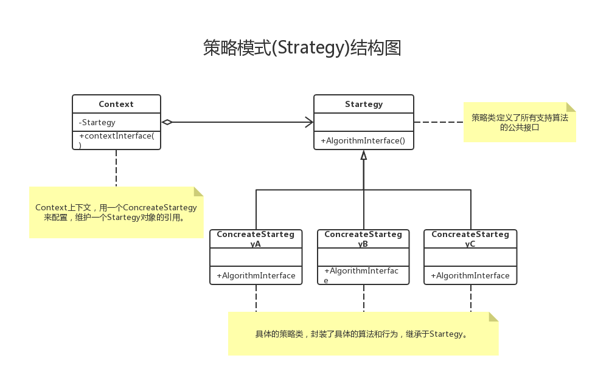

# Strategy-策略模式

## 一. 概念

### 1. 什么是策略模式

- 从一系列里抽象出不变的部分
- 策略模式是将可变的部分从程序中抽象分离成算法接口，在该接口下分别封装一系列算法实现，并使他们可以相互替换，从而导致客户端程序独立于算法的改变。

### 2. 策略模式如何实现

**1.继承-在父类中提供实现方法，子类通过继承获得父类中的行为**

- 优点：简单易用，已有的类可以快速添加父类的方法
- 缺点：不具有灵活性，对未来的变更支持差，需要覆写子类的方法来提供新的行为

**2.抽象方法-在父类中提供抽象方法，强迫子类实现自己的行为**

- 优点：足够灵活。
- 缺点：每个子类都要实现一遍代码，即使相同的行为也不例外，代码重复，没有复用的代码。

**3.组合-策略模式核心**

- 解释：在类中增加一个私有域，引用另一个已有的类的实例，通过调用引用实例的方法从而获得新的功能，这种设计称作组合（复合）。
将行为抽象为接口，在父类中持有该接口，并由该接口代替接口飞行行为
- 优点：
    - 足够灵活，复用代码，更易于维护
    - 使用了组合，使架构更加灵活
    - 富有弹性，可以较好的应对变化（开--闭原则）
    - 正好的代码复用型（相对于继承）
    - 消除大量的条件语句
- 缺点：
    - 客户代码需要了解每个策略实现的细节
    - 增加了对象的数目（维护困难）

**4.注意**
- 继承是重用代码的利器，但继承并不是最好的工具。
- Favor composition over inheritance.(复合优于继承)

### 3. 策略模式的实现

1. 通过分离变化得出的策略接口Strategy
2. Strategy的实现类
3. 客户程序中有一个Strategy
4. 在客户程序中选择/组装正确的Strategy实现

### 4. 策略模式总结篇
1. 将一些方法抽象成接口
2. 在基类中实例化接口
3. 设置接口的私有成员变量
4. 在积累中调用接口的同样方法
5. 这样实现了代码的复用
6. 面向接口编程,而不是面向实现编程,多用组合

### 5. 适用场景
1. 许多相关的类仅仅是行为差异
2. 运行时选取不同的算法遍体
3. 通过条件语句在多个分支中选取一

## 二.实例Demo

### 1.使用策略模式实现超市促销
