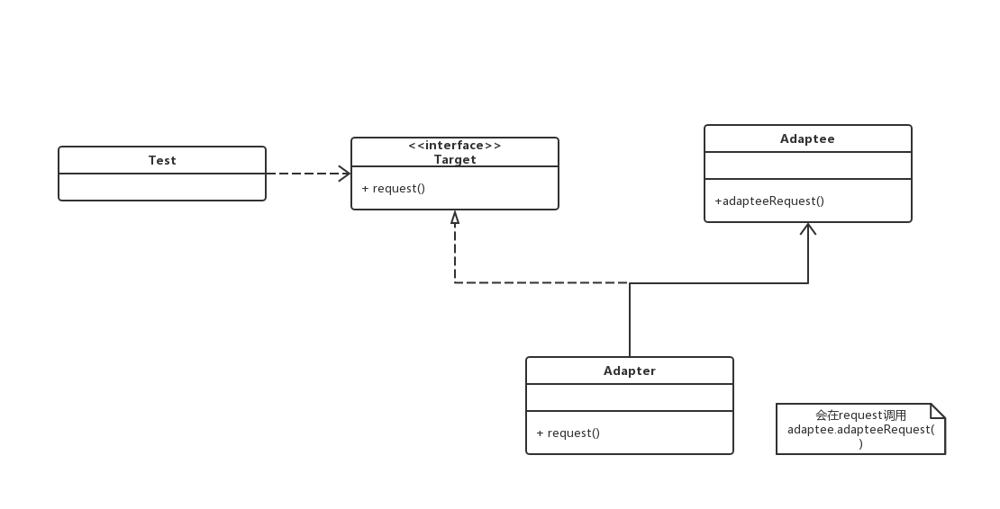
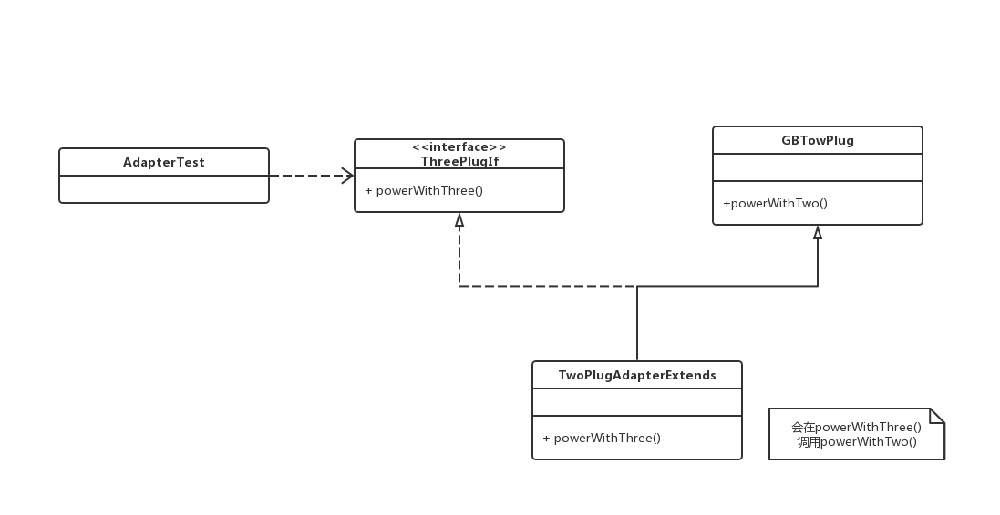
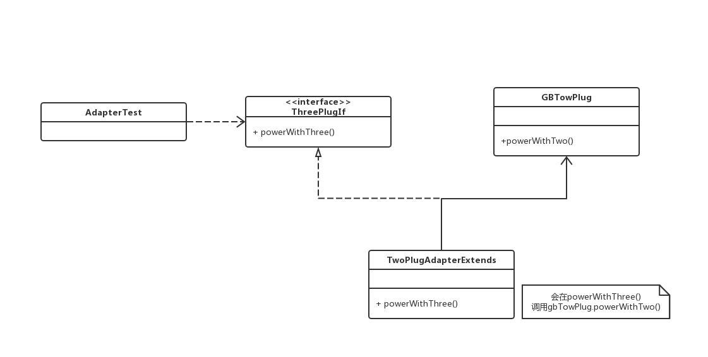

# 适配器模式

## 0x01.定义和类型

- 定义：将一个类的接口转换成客户期望的另一个接口，适配器模式让那些不兼容的类可以一起工作。
- 类型：结构型

### a.类适配器模式

- 类适配器模式：使用继承的方式去实现接口适配。
- UML：


- Java实现

```java
/**
 * 客户需要的接口
 */
public interface Target {
    void request();
}

/**
 * 被适配的类
 */
public class Adaptee {
    public void adapteeRequest () {
        System.out.println("被适配者的方法");
    }
}

/**
 * 适配器，继承了被适配的类，并且实现了Target定义的接口
 */
public class Adapter extends Adaptee implements Target {
    @Override
    public void request() {
        //todo...
        System.out.println("适配后----");
        super.adapteeRequest();
        //todo...
    }
}
```

- 测试与应用

```java
/**
 * 测试类
 */
public class Test {
    public static void main(String[] args) {
        Adaptee adaptee = new Adaptee();
        adaptee.adapteeRequest();

        Target adapterTarget = new Adapter();
        adapterTarget.request();
    }
}
```

- 输出结果

```log
被适配者的方法
适配后----
被适配者的方法
```

### b.对象适配器模式

- 对象适配器模式：使用组合的方式去实现接口适配
- UML



- Java实现

```java
/**
 * 客户端应用放使用的接口
 */
public interface Target {
    void request();
}

/**
 * 被适配的类
 */
public class Adaptee {
    public void adapteeRequest () {
        System.out.println("被适配者的方法");
    }
}

/**
 * 适配器模式
 */
public class Adapter implements Target {

    /**
     * 组合了被适配的类，这里可以通过set方式注入
     */
    private Adaptee adaptee = new Adaptee();

    @Override
    public void request() {
        //todo...
        System.out.println("适配后----");
        adaptee.adapteeRequest();
        //todo...
    }
}
```

- 应用与测试类

```java
/**
 * 应用测试类
 */
public class Test {

    public static void main(String[] args) {
        Adaptee adaptee = new Adaptee();
        adaptee.adapteeRequest();

        Target adapterTarget = new Adapter();
        adapterTarget.request();
    }
}
```

- 输入结果

```log
被适配者的方法
适配后----
被适配者的方法
```

### c.角色介绍

- 从上面两种情况可以看出，适配器模式一共有三个角色
  - Target(目标抽象类)：目标抽象类定义客户所需的接口，可以是一个抽象类或接口，也可以是具体类。
  - Adapter(适配器类)：它可以调用另一个接口，作为一个转换器，对Adaptee和Target进行适配。它是适配器模式的核心。
  - Adaptee(适配者类)：适配者即被适配的角色，它定义了一个已经存在的接口，这个接口需要适配，适配者类包好了客户希望的业务方法。

## 0x02.适用场景

- 已经存在的类，它的方法和需求不匹配时（方法结果相同或相似）
- 创建一个可以重复使用的类，用于和一些彼此之间没有太大关联的类，包括一些可能在将来引进的类一起工作
- 适配器模式不是软件设计阶段考虑的设计模式，是随着软件维护，由于不同产品，不同厂家造成功能类似而接口不相同情况下的解决方案。

## 0x03.优点

- 能提高类的透明性和复用，将具体的业务实现过程封装在适配者类中，对于客户端类而言是透明的，现有的类复用但不需要改变，而且提高了适配者的复用性，同一适配者类可以在多个不同的系统中复用。
- 目标类和适配器类解耦，通过引入一个适配器类来重用现有的适配者类，无需修改原有结构，提高程序扩展性。
- 灵活性和扩展性都非常好，通过使用配置文件，可以很方便的更换适配器，也可以在不修改原有代码的基础上，增加新的适配器，符合开闭原则。

## 0x04.缺点

- 适配器编写过程需要全面考虑，可能会增加系统的复杂性。
- 一次最多只能适配一个适配者类，不能同时适配多个适配者。
- 增加系统代码可读的难度。

## 0x05. 样例实现

> 笔记本的插头为三项电，而现有的插座是两项的，需要适配器来进行适配，下面分别进行两种方式的实现。

- 通用代码

```java
/**
 * 三项插座接口
 * @author Administrator
 *
 */
public interface ThreePlugIf {
    //使用三项电流供电
    void powerWithThree();
}

/**
 * 二项电插座
 */
public class GBTowPlug {
    //使用二项电流供电
    public void powerWithTwo () {
        System.out.println("使用二项电流供电");
    }
}

/**
 * 笔记本类
 */
public class NoteBook {

    private ThreePlugIf plug;

    /**
     * 只接收使用三项电充电
     * @param plug
     */
    public NoteBook (ThreePlugIf plug) {
        this.plug = plug;
    }

    /**
     * 使用插座充电
     */
    public void charge () {
        plug.powerWithThree();
    }
}

```

### a.类适配器的实现

- 具体Java代码

```java
/**
 * 采用继承方式的插座适配器
 * @author Administrator
 */
public class TwoPlugAdapterExtends extends GBTowPlug implements ThreePlugIf {

    public void powerWithThree() {
        System.out.println("借助继承适配器");
        this.powerWithTwo();
    }
}
```

- 测试与应用类

```java
/**
 * 测试与应用类
 */
public class AdapterTest {

    public static void main(String[] args) {
        ThreePlugIf three = new TwoPlugAdapterExtends();
        NoteBook book = new NoteBook(three);
        book.charge();
    }
}
```

- 输出结果

```log
借助继承适配器
使用二项电流供电
```

- 样例UML类图：



### b.对象适配器的实现

- 具体Java代码

```java
/**
 * 二项插座转三项插座的适配器
 */
public class TwoPlugAdapter implements ThreePlugIf {

    /**
    * 组合
    */
    private GBTowPlug plug;

    public TwoPlugAdapter (GBTowPlug plug) {
        this.plug = plug;
    }

    public void powerWithThree() {
        System.out.println("通过转化");
        plug.powerWithTwo();
    }
}
```

- 测试与应用类

```java
/**
 * 测试与应用类
 */
public class AdapterTest {
    public static void main(String[] args) {
        GBTowPlug two = new GBTowPlug();
        ThreePlugIf three = new TwoPlugAdapter(two);
        NoteBook book = new NoteBook(three);
        book.charge();
    }
}
```

- 输出结果

```log
对象适配器-通过转化
使用二项电流供电
```

- 样例UML类图：



## 0x06.相关设计模式

- 适配器模式和外观模式
  - 对现有的类现存系统的封装
  - 外观：定义了新的接口，创建新的接口对现有接口的封装
  - 适配器：复用原有的接口，使两个已有的接口协同工作
  - 两种：适配的力度不同，外观针对的力度更大

## 0x07.源码中的适配器

- JDK: XmlAdapter
- Spring AOP: AdvisorAdapter, MethodBeforeAdvice
- Spring Data JPA: JpaVendorAdapter
- Spring MVC: Handler Adacpter

## 0x08.源码地址

- `适配器模式`: [https://github.com/sigmako/design-pattern/tree/master/adapter](https://github.com/sigmako/design-pattern/tree/master/adapter)

## 0x09.参考

- `慕课网设计模式精讲`: [https://coding.imooc.com/class/270.html](https://coding.imooc.com/class/270.html)
- `设计模式：适配器模式`: [https://www.cnblogs.com/songyaqi/p/4805820.html](https://www.cnblogs.com/songyaqi/p/4805820.html)
