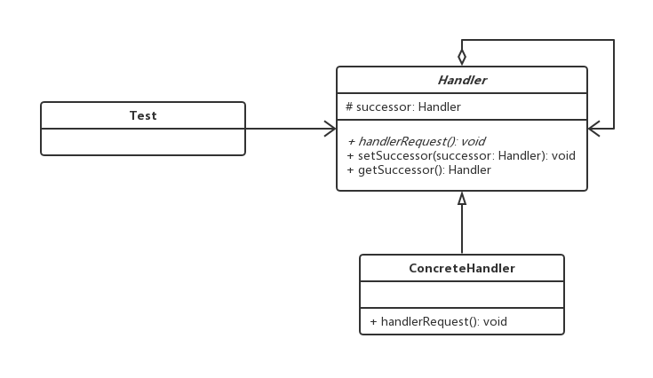
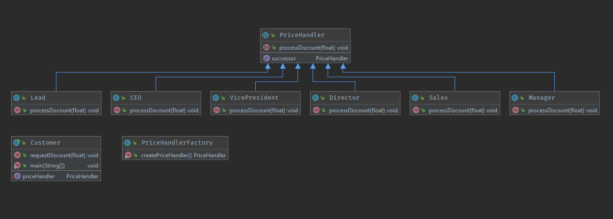

# 责任链模式

## 0x01.定义与类型

- 定义：为了避免请求发送者与多个请求处理者耦合在一起，将所有请求的处理者通过前一对象记住其下一个对象的引用而连成一条链；当有请求发生时，可将请求沿着这条链传递，直到有对象处理它为止。
- 类型：行为型
- UML类图



- java实现

```java
/**
 * 抽象处理类
 */
public abstract class Handler {

    //责任链下一个节点
    protected Handler successor;

    /**
     * 处理请求
     */
    public abstract void handlerRequest(Integer count);

    public Handler getSuccessor() {
        return successor;
    }

    public void setSuccessor(Handler successor) {
        this.successor = successor;
    }
}

/**
 * 实际责任链处理器1
 */
public class ConcreteHandler1 extends Handler {
    @Override
    public void handlerRequest(Integer count) {
        System.out.println("goto ConcreteHandler1");
        if (count <= 0) {
            System.out.println("ConcreteHandler1 process.");
        } else if (getSuccessor() != null) {
            getSuccessor().handlerRequest(count);
        }
    }
}

/**
 * 实际责任链处理器2
 */
public class ConcreteHandler2 extends Handler {
    @Override
    public void handlerRequest(Integer count) {
        System.out.println("goto ConcreteHandler2");
        if (count > 0) {
            System.out.println("ConcreteHandler2 process.");
        } else if (getSuccessor() != null) {
            getSuccessor().handlerRequest(count);
        }
    }
}
```

- 测试与应用

```java
/**
 * 测试与应用
 */
public class Test {

    public static void main(String[] args) {
        //创建责任链
        Handler handler1 = new ConcreteHandler1();
        Handler handler2 = new ConcreteHandler2();

        //组装
        handler1.setSuccessor(handler2);

        //处理
        handler1.handlerRequest(1);
    }
}
```

- 输入结果

```log
goto ConcreteHandler1
goto ConcreteHandler2
ConcreteHandler2 process.
```

- 角色介绍
  - 抽象处理者(Handler)角色：定义出一个处理请求的接口。如果需要，接口可以定义出一个方法以设定和返回对下家的引用。这个角色通常由一个Java抽象类或者Java接口实现。上图中Handler类的聚合关系给出了具体子类对下家的引用，抽象方法handleRequest()规范了子类处理请求的操作。
  - 具体处理者(ConcreteHandler)角色：具体处理者接到请求后，可以选择将请求处理掉，或者将请求传给下家。由于具体处理者持有对下家的引用，因此，如果需要，具体处理者可以访问下家。

## 0x02.适用场景

- 一个请求的处理需要多个对象当中的一个或几个协作处理
- if else比较多的情况，可以考虑是否合适

## 0x03.优缺点

### 1.优点

- 降低了对象之间的耦合度。该模式使得一个对象无须知道到底是哪一个对象处理其请求以及链的结构，发送者和接收者也无须拥有对方的明确信息。
- 增强了系统的可扩展性。可以根据需要增加新的请求处理类，满足开闭原则。
- 增强了给对象指派职责的灵活性。当工作流程发生变化，可以动态地改变链内的成员或者调动它们的次序，也可动态地新增或者删除责任。
- 责任链简化了对象之间的连接。每个对象只需保持一个指向其后继者的引用，不需保持其他所有处理者的引用，这避免了使用众多的 if 或者 if···else 语句。
- 责任分担。每个类只需要处理自己该处理的工作，不该处理的传递给下一个对象完成，明确各类的责任范围，符合类的单一职责原则。

### 2.缺点

- 不能保证每个请求一定被处理。由于一个请求没有明确的接收者，所以不能保证它一定会被处理，该请求可能一直传到链的末端都得不到处理。
- 对比较长的职责链，请求的处理可能涉及多个处理对象，系统性能将受到一定影响。
- 职责链建立的合理性要靠客户端来保证，增加了客户端的复杂性，可能会由于职责链的错误设置而导致系统出错，如可能会造成循环调用。

## 0x04.责任链模式样例

> 你去买东西想要申请折扣，每个level的人只能批准自己范围内的，批准不了的只能上报给leader.

- java代码

```java
/**
 * 价格处理人, 负责处理客户的责任申请
 */
public abstract class PriceHandler {

    /**
     * 直接后继, 用于处理请求
     */
    protected PriceHandler successor;

    public void setSuccessor(PriceHandler successor) {
        this.successor = successor;
    }

    /**
     * 处理折扣申请
     */
    public abstract void processDiscount(float discount);

}

//下面是责任链的各个节点
public class CEO extends PriceHandler {

    @Override
    public void processDiscount(float discount) {

        if (discount <= 0.55) {
            System.out.format("%s approved: %.2f%n", this.getClass().getName(), discount);
        } else {
            System.out.format("%s refused: %.2f%n", this.getClass().getName(), discount);
        }
    }

}

public class Director extends PriceHandler {

    @Override
    public void processDiscount(float discount) {

        if (discount <= 0.35) {
            System.out.format("%s approved: %.2f%n", this.getClass().getName(), discount);
        } else {
            successor.processDiscount(discount);
        }
    }

}

public class Lead extends PriceHandler {

    @Override
    public void processDiscount(float discount) {

        if (discount <= 0.15) {
            System.out.format("%s approved: %.2f%n", this.getClass().getName(), discount);
        } else {
            successor.processDiscount(discount);
        }
    }

}

public class Manager extends PriceHandler {

    @Override
    public void processDiscount(float discount) {

        if (discount <= 0.2) {
            System.out.format("%s approved: %.2f%n", this.getClass().getName(), discount);
        } else {
            successor.processDiscount(discount);
        }
    }

}

public class Sales extends PriceHandler {

    @Override
    public void processDiscount(float discount) {

        if (discount <= 0.05) {
            System.out.format("%s approved: %.2f%n", this.getClass().getName(), discount);
        } else {
            successor.processDiscount(discount);
        }
    }

}

public class VicePresident extends PriceHandler {

    @Override
    public void processDiscount(float discount) {

        if (discount <= 0.45) {
            System.out.format("%s approved: %.2f%n", this.getClass().getName(), discount);
        } else {
            successor.processDiscount(discount);
        }
    }

}

//责任链拼装工厂
public class PriceHandlerFactory {

    /**
     * 获取PriceHandler 对象
     * @return PriceHandler
     */
    public static PriceHandler createPriceHandler() {

        PriceHandler sales = new Sales();
        PriceHandler lead = new Lead();
        PriceHandler manager = new Manager();
        PriceHandler director = new Director();
        PriceHandler vp = new VicePresident();
        PriceHandler ceo = new CEO();

        sales.setSuccessor(lead);
        lead.setSuccessor(manager);
        manager.setSuccessor(director);
        director.setSuccessor(vp);
        vp.setSuccessor(ceo);
        return sales;
    }
}
```

- 客户类（应用类）

```java
/**
 * 客户, 申请折扣
 */
public class Customer {

    private PriceHandler priceHandler;

    public void setPriceHandler(PriceHandler priceHandler) {
        this.priceHandler = priceHandler;
    }

    public void requestDiscount (float discount) {
        priceHandler.processDiscount(discount);
    }


    public static void main(String[] args) {
        Customer customer = new Customer();
        customer.setPriceHandler(PriceHandlerFactory.createPriceHandler());

        Random random = new Random();

        for (int i = 0; i < 10; i++) {
            System.out.print((i + 1) + ":");
            customer.requestDiscount(random.nextFloat());
        }

    }
}
```

- 运行结果

```log
1:org.ko.cor.demo1.handler.CEO approved: 0.46
2:org.ko.cor.demo1.handler.CEO refused: 0.55
3:org.ko.cor.demo1.handler.CEO refused: 0.61
4:org.ko.cor.demo1.handler.CEO approved: 0.53
5:org.ko.cor.demo1.handler.CEO refused: 0.83
6:org.ko.cor.demo1.handler.CEO refused: 0.72
7:org.ko.cor.demo1.handler.CEO refused: 0.69
8:org.ko.cor.demo1.handler.Director approved: 0.28
9:org.ko.cor.demo1.handler.Lead approved: 0.07
10:org.ko.cor.demo1.handler.CEO refused: 0.93
```

- UML类图



## 0x05.相关的设计模式

- 责任链模式和状态模式
  - 责任链模式各个对象并不指定下一个处理的对象是谁
  - 状态模式：让每个状态对象知道下一个对象是谁


## 0x06.源码中的责任链模式

- Servlet.FilterChainr#doFilter
- SpringSecurity

## 0x07.源码地址

- `设计模式之责任链模式`：[https://github.com/sigmaol/design-pattern/tree/master/chain-of-responsibility](https://github.com/sigmaol/design-pattern/tree/master/chain-of-responsibility)

## 0x08.推荐阅读

- `慕课网设计模式精讲`：[https://coding.imooc.com/class/270.html](https://coding.imooc.com/class/270.html)
- `责任链模式（职责链模式）详解`：[http://c.biancheng.net/view/1383.html](http://c.biancheng.net/view/1383.html)
- `《JAVA与模式》之责任链模式`：[https://www.cnblogs.com/java-my-life/archive/2012/05/28/2516865.html](https://www.cnblogs.com/java-my-life/archive/2012/05/28/2516865.html)
