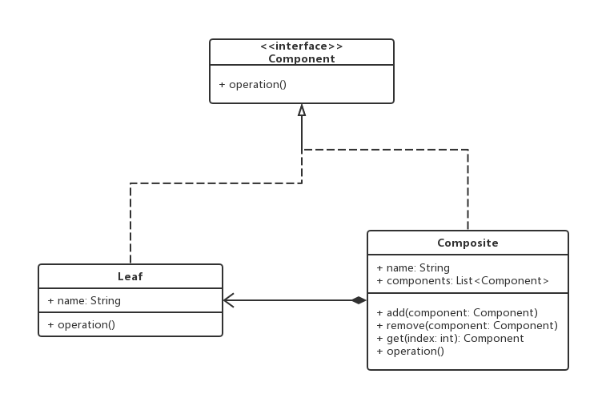
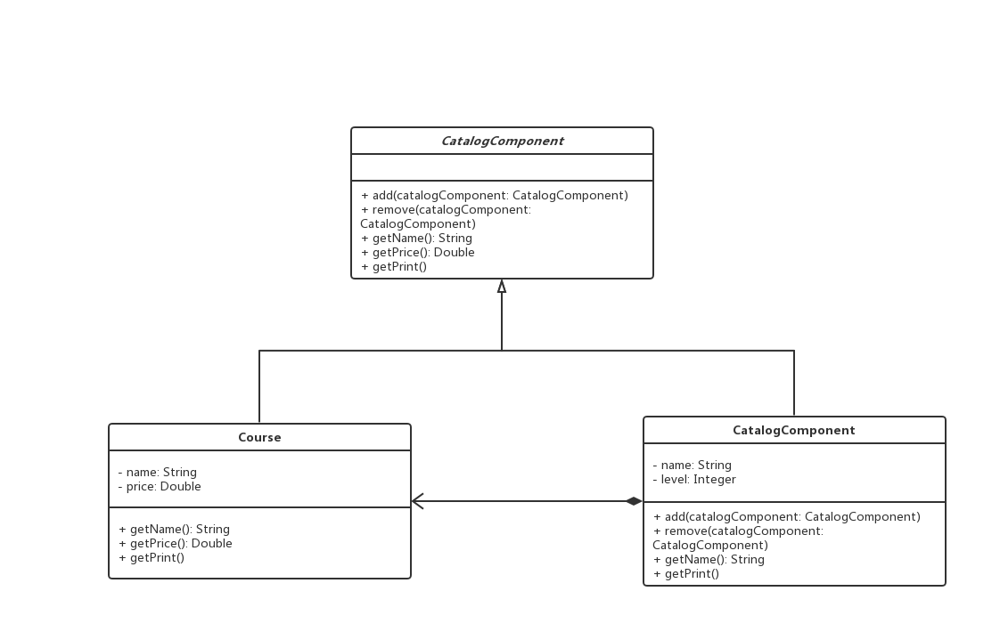

# 组合模式

## 0x01.定义与类型

- 定义：将对象组合成树形结构以表示“部分-整体”的层次结构，使客户端对单个对象和组合对象保持一致的方式处理
- 组合模式实现的最关键的地方是：简单对象和复合对象必须实现相同的接口，这就是组合模式能够将组合对象和简单对象进行一致处理的原因。
- 类型：结构型
- UML类图



- Java实现

```java
/**
 * 组合模式统一接口类
 */
public interface Component {
    void operation();
}

/**
 * 组合类
 */
public class Composite implements Component {

    private String name;

    private List<Component> components = new ArrayList<>();

    public Composite(String name) {
        this.name = name;
    }

    public void add(Component component) {
        components.add(component);
    }

    public void remove (Component component) {
        components.remove(component);
    }

    public Component get(int index) {
        return components.get(index);
    }

    @Override
    public void operation() {
        System.out.println(this.name);
        for (Component component : components) {
            component.operation();
        }
    }
}

/**
 * 简单类
 */
public class Leaf implements Component {

    private String name;

    public Leaf(String name) {
        this.name = name;
    }

    @Override
    public void operation() {
        System.out.println(this.name);
    }

    public String getName() {
        return name;
    }
}
```

- 测试与应用类

```java
/**
 * 应用与测试
 */
public class Test {

    public static void main(String[] args) {
        Composite composite = new Composite("树枝1");

        Leaf leaf1 = new Leaf("树枝1树叶1");
        Leaf leaf2 = new Leaf("树枝1树叶2");
        Leaf leaf3 = new Leaf("树枝1树叶3");

        composite.add(leaf1);
        composite.add(leaf2);
        composite.add(leaf3);

        Composite composite1 = new Composite("树");

        Leaf leaf4 = new Leaf("树叶4");
        Leaf leaf5 = new Leaf("树叶5");

        composite1.add(leaf4);
        composite1.add(leaf5);
        composite1.add(composite);

        composite1.operation();
    }
}
```

- 输入结果

```log
树
树叶4
树叶5
树枝1
树枝1树叶1
树枝1树叶2
树枝1树叶3
```

- 组合模式中的透明式以及安全式
  - 透明式：组合模式中的抽象构件还声明访问和管理子类的接口，客户端使用的适合不需要区分叶子节点和树枝节点，但是叶子节点本身并不存在操作方法，一般会给出默认实现，比如抛出异常。
  - 安全式：组合模式中的抽象构件不声明管理子类的接口，把操作移交给子类完成。这样叶子节点不需要实现操作方法，但是客户端使用时必须做出区分，为使用带来麻烦。
  - 上面的方式中使用的是安全模式。
- 组合模式中的角色
  - 抽象构件（Component）角色：它的主要作用是为树叶构件和树枝构件声明公共接口，并实现它们的默认行为。在透明式的组合模式中抽象构件还声明访问和管理子类的接口；在安全式的组合模式中不声明访问和管理子类的接口，管理工作由树枝构件完成。
  - 树叶构件（Leaf）角色：是组合中的叶节点对象，它没有子节点，用于实现抽象构件声明的公共接口。
  - 树枝构件（Composite）角色：是组合中的分支节点对象，它有子节点。它实现了抽象构件角色中声明的接口，它的主要作用是存储和管理子部件，通常包含 add()、remove()、get() 等方法。

## 0x02.适用场景

- 希望用户忽略组合对象与单个对象的不同，用户将统一地使用组合结构中的所有对象时。
- 当想表达对象的部分-整体的层次结构时。

## 0x03.优点

- 清楚地定义分层次的复杂对象，表示对象的全部或部分层次
- 组合模式使得客户端代码可以一致地处理对象和对象容器，无需关心处理的单个对象，还是组合的对象容器。
- 简化客户端代码
- 符合开闭原则

## 0x04.缺点

- 限制类型时会较为复杂。
- 使设计变得更加抽象，客户端需要花更多时间理清类之间的层次关系。

## 0x05.组合模式实现样例

> 使用组合模式实现目录和课程之间的关系。

- 因为上面给出的basic实现安全模式的，这次的样例使用透明模式实现。

- Java代码

```java
/**
 * 通用的抽象类
 */
public abstract class CatalogComponent {

    public void add (CatalogComponent catalogComponent) {
        throw new UnsupportedOperationException("不支持添加操作");
    }

    public void remove (CatalogComponent catalogComponent) {
        throw new UnsupportedOperationException("不支持删除操作");
    }

    public String getName () {
        throw new UnsupportedOperationException("不支持获取名称操作");
    }

    public Double getPrice () {
        throw new UnsupportedOperationException("不支持获取价钱操作");
    }

    public void print () {
        throw new UnsupportedOperationException("不支持打印操作");
    }

}

/**
 * 目录
 */
public class CourseCatalog extends CatalogComponent {

    private List<CatalogComponent> itsms = new ArrayList<>();

    private String name;

    private Integer level;

    public CourseCatalog(String name, Integer level) {
        this.name = name;
        this.level = level;
    }

    @Override
    public String getName() {
        return this.name;
    }

    @Override
    public void add(CatalogComponent catalogComponent) {
        this.itsms.add(catalogComponent);
    }

    @Override
    public void remove(CatalogComponent catalogComponent) {
        this.itsms.remove(catalogComponent);
    }

    @Override
    public void print() {
        System.out.println("> " + this.name);
        for (CatalogComponent catalogComponent : itsms) {
            if (this.level != null) {
                for (int i = 0; i < this.level; i ++) {
                    System.out.print("--");
                }
            }
            catalogComponent.print();
        }
    }
}

/**
 * 具体的课程
 */
public class Course extends CatalogComponent {

    private String name;

    private Double price;

    public Course(String name, Double price) {
        this.name = name;
        this.price = price;
    }

    @Override
    public String getName() {
        return this.name;
    }

    @Override
    public Double getPrice() {
        return this.price;
    }

    @Override
    public void print() {
        System.out.println("> Course Name：" + this.name + ": price: " + this.price);
    }
}
```

- 测试与应用

```java
/**
 * 测试与应用
 */
public class Test {

    public static void main(String[] args) {
        CatalogComponent linuxCourse = new Course("Linux课程", 11D);
        CatalogComponent windowCourse = new Course("Window课程", 12D);

        CatalogComponent javaCourseCatalog = new CourseCatalog("Java课程目录", 2);

        CatalogComponent mmallCourse1 = new Course("Java电商一期", 55D);
        CatalogComponent mmallCourse2 = new Course("Java电商二期", 66D);
        CatalogComponent designPattern = new Course("Java设计模式", 77D);

        javaCourseCatalog.add(mmallCourse1);
        javaCourseCatalog.add(mmallCourse2);
        javaCourseCatalog.add(designPattern);

        CatalogComponent mainCourseCatalog = new CourseCatalog("课程主目录", 1);

        mainCourseCatalog.add(linuxCourse);
        mainCourseCatalog.add(windowCourse);
        mainCourseCatalog.add(javaCourseCatalog);

        mainCourseCatalog.print();
    }
}

```

- UML类图



## 0x06.相关设计模式

- 组合模式和访问者模式
  - 可以适用访问者模式来访问组合模式中的递归结构

## 0x07.源码中的组合模式

- java.awt.Container
- HashMap.putAll
- ArrayList.addAll
- MyBatis.SqlNode

## 0x08.代码地址

- `设计模式之组合模式`：[https://github.com/sigmako/design-pattern/tree/master/composite](https://github.com/sigmako/design-pattern/tree/master/composite)

## 0x09.参考

- `慕课网设计模式精讲`: [https://coding.imooc.com/class/270.html](https://coding.imooc.com/class/270.html)
- `组合模式（详解版）`: [http://c.biancheng.net/view/1373.html](http://c.biancheng.net/view/1373.html)
- `设计模式之组合模式`: [https://www.cnblogs.com/snaildev/p/7647190.html](https://www.cnblogs.com/snaildev/p/7647190.html)
