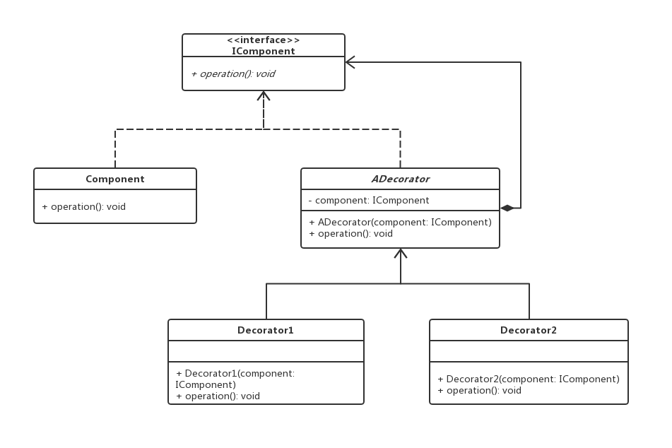
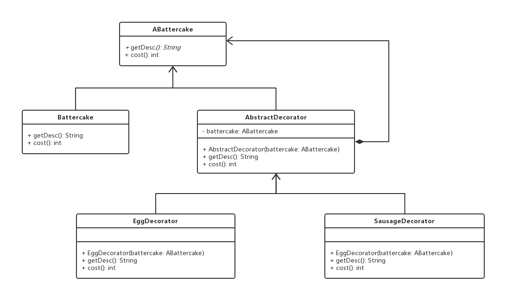
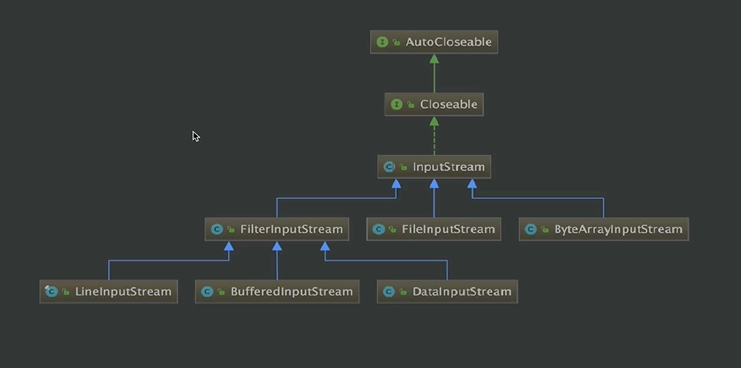

# 装饰者模式

## 0x01.定义与类型

- 定义：装饰模式指的是在不必改变原类文件和使用继承的情况下，动态地扩展一个对象的功能。它是通过创建一个包装对象，也就是装饰来包裹真实的对象。
- 特点:
  - 装饰对象和真实对象有相同的接口。这样客户端对象就能以和真实对象相同的方式和装饰对象交互。
  - 装饰对象包含一个真实对象的引用（reference）
  - 装饰对象接受所有来自客户端的请求。它把这些请求转发给真实的对象。
  - 装饰对象可以在转发这些请求以前或以后增加一些附加功能。这样就确保了在运行时，不用修改给定对象的结构就可以在外部增加附加的功能。在面向对象的设计中，通常是通过继承来实现对给定类的功能扩展。
- 类型：结构型
- UML类图



- 样例实现
  
```java
/**
* 组件类接口
*/
public interface IComponent {
    void operation();
}

/**
* 具体组件类的具体业务逻辑实现
*/
public class Component implements IComponent {
    @Override
    public void operation() {
        System.out.println("component operation!");
    }
}

/**
* 装饰器的抽象类
*/
public abstract class ADecorator implements IComponent {
    /**
    * 关键在于这个组合组件接口对象
    */
    private IComponent component;

    public ADecorator(IComponent component) {
        this.component = component;
    }

    @Override
    public void operation () {
        component.operation();
    }
}

/**
* 装饰器具体实现1
*/
public class Decorator1 extends ADecorator {
    public Decorator1(IComponent component) {
        super(component);
    }

    @Override
    public void operation() {
        super.operation();
        System.out.println("decorator1");
    }
}

/**
* 装饰器具体实现2
*/
public class Decorator2 extends ADecorator {

    public Decorator2(IComponent component) {
        super(component);
    }

    @Override
    public void operation() {
        super.operation();
        System.out.println("decorator2");
    }
}
```

- 测试与应用类

```java
/**
* 应用与测试类
*/
public class Test {

    public static void main(String[] args) {
        //应用类
        IComponent component;

        //初始化
        component = new Component();

        //装饰
        component = new Decorator1(component);
        component = new Decorator2(component);

        //具体方法的调用
        component.operation();
    }
}
```

- 输出结果

```log
component operation!
decorator1
decorator2
```

- 装饰着模式中的各组件：
  - 抽象构件(IComponent)角色：给出一个抽象接口，以规范准备接收附加责任的对象。
  - 具体构件(Component)角色：定义一个将要接收附加责任的类。
  - 装饰(ADecorator)角色：持有一个构件(IComponent)对象的实例，并定义一个与抽象构件接口一致的接口。
  - 具体装饰(Decorator1/Decorator2)角色：负责给构件对象“贴上”附加的责任。

## 0x02.使用场景

- 需要扩展一个类的功能，或给一个类添加附加职责。
- 需要动态的给一个对象添加功能，这些功能可以再动态的撤销。
- 需要增加由一些基本功能的排列组合而产生的非常大量的功能，从而使继承关系变的不现实。
- 当不能采用生成子类的方法进行扩充时。一种情况是，可能有大量独立的扩展，为支持每一种组合将产生大量的子类，使得子类数目呈爆炸性增长。另一种情况可能是因为类定义被隐藏，或类定义不能用于生成子类。

## 0x03.优点

- Decorator模式与继承关系的目的都是要扩展对象的功能，但是Decorator可以提供比继承更多的灵活性。
- 通过使用不同的具体装饰类以及这些装饰类的排列组合，设计师可以创造出很多不同行为的组合。
- 符合开闭原则

## 0x04.缺点

- 这种比继承更加灵活机动的特性，也同时意味着更加多的复杂性。
- 装饰模式会导致设计中出现许多小类，如果过度使用，会使程序变得很复杂。
- 装饰模式是针对抽象组件（Component）类型编程。但是，如果你要针对具体组件编程时，就应该重新思考你的应用架构，以及装饰者是否合适。当然也可以改变Component接口，增加新的公开的行为，实现“半透明”的装饰者模式。在实际项目中要做出最佳选择

## 0x05.举例实现装饰着模式

> 我们买煎饼果子可以选择加香肠，还是加鸡蛋。煎饼果子就是我们的组件类，而加鸡蛋加培根则是装饰者的具体实现类.

- 装饰者模式Java实现

```java
/**
 * 煎饼的抽象类，也就是组建类
 */
public abstract class ABattercake {

    /**
     * 最后的描述
     * @return
     */
    protected abstract String getDesc ();

    /**
     * 总共的价格
     * @return
     */
    protected abstract int cost ();

}


/**
 * 煎饼的具体实现
 */
public class Battercake extends ABattercake {
    @Override
    protected String getDesc() {
        return "煎饼";
    }

    @Override
    protected int cost() {
        return 8;
    }
}

/**
 * 装饰着的抽象类
 */
public abstract class AbstractDecorator extends ABattercake {

    //组合的煎饼对象
    private ABattercake aBattercake;

    public AbstractDecorator(ABattercake aBattercake) {
        this.aBattercake = aBattercake;
    }

    protected abstract void doSomething();

    @Override
    protected String getDesc() {
        return aBattercake.getDesc();
    }

    @Override
    protected int cost() {
        return aBattercake.cost();
    }
}

/**
 * 装饰者的具体实现
 */
public class EggDecorator extends AbstractDecorator {

    public EggDecorator(ABattercake aBattercake) {
        super(aBattercake);
    }

    @Override
    protected void doSomething() {

    }

    @Override
    protected String getDesc() {
        return super.getDesc() + " 加一个鸡蛋";
    }

    @Override
    protected int cost() {
        return super.cost() + 1;
    }
}

/**
 * 装饰者的具体实现
 */
public class SausageDecorator extends AbstractDecorator {

    public SausageDecorator(ABattercake aBattercake) {
        super(aBattercake);
    }

    @Override
    protected void doSomething() {

    }

    @Override
    protected String getDesc() {
        return super.getDesc() + " 加一根香肠";
    }

    @Override
    protected int cost() {
        return super.cost() + 2;
    }
}
```

- 应用的测试类

```java
public class Test {

    public static void main(String[] args) {
        ABattercake aBattercake;

        aBattercake = new Battercake();
        aBattercake = new EggDecorator(aBattercake);
        aBattercake = new EggDecorator(aBattercake);
        aBattercake = new SausageDecorator(aBattercake);

        System.out.println(aBattercake.getDesc() + "销售价格：" + aBattercake.cost());
    }
}

```

- 输入结果

```log
煎饼 加一个鸡蛋 加一个鸡蛋 加一根香肠销售价格：12
```

- 样例UML类图



- 注意:装饰者最上层的类是否使用抽象类，这个是看业务的。

## 0x06.相关设计模式

- 装饰者模式和代理模式
  - 装饰者模式：关注再一个对象上动态添加方法
  - 代理模式：关注再对代理对象的控制访问，可以对客户隐藏被代理类的信息
- 装饰着模式和适配器模式
  - 都叫包装模式
  - 关于新职责：适配器也可以在转换时增加新的职责，但主要目的不在此。装饰者模式主要是给被装饰者增加新职责的。
  - 关于原接口：适配器模式是用新接口来调用原接口，原接口对新系统是不可见或者说不可用的。装饰者模式原封不动的使用原接口，系统对装饰的对象也通过原接口来完成使用。（增加新接口的装饰者模式可以认为是其变种--“半透明”装饰者）
  - 关于其包裹的对象：适配器是知道被适配者的详细情况的（就是那个类或那个接口）。装饰者只知道其接口是什么，至于其具体类型（是基类还是其他派生类）只有在运行期间才知道。

## 0x07.源码中的装饰者

- BufferedReader
- BufferInputStream/BufferOutputStream



- Spring. TransactionAwareCacheDecorator
- Mybatis. Cache

## 0x08.源码

`设计模式之装饰着模式`: [https://github.com/sigmako/design-pattern/tree/master/decorator](https://github.com/sigmako/design-pattern/tree/master/decorator)

## 0x09.参考

- `慕课网设计模式精讲`: [https://coding.imooc.com/class/270.html](https://coding.imooc.com/class/270.html)
- `《JAVA与模式》之装饰模式`: [https://www.cnblogs.com/java-my-life/archive/2012/04/20/2455726.html](https://www.cnblogs.com/java-my-life/archive/2012/04/20/2455726.html)
