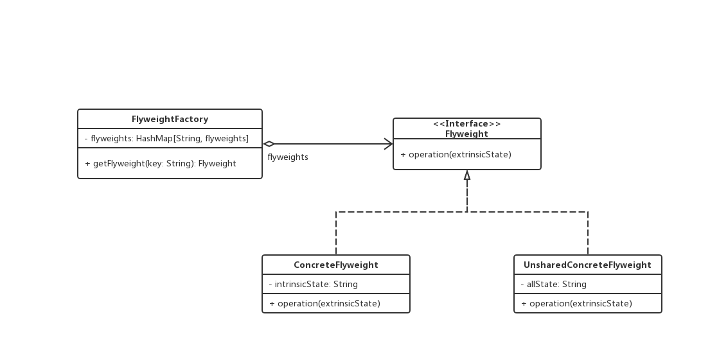
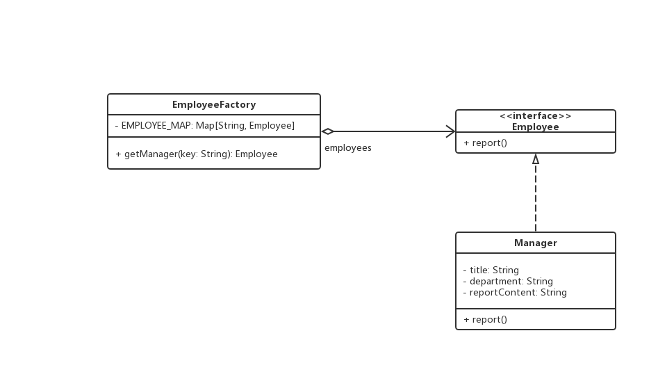

# 享元模式

## 0x01.定义与类型

- 定义：提供了减少对象数量从而改善应用所需的对象结构的方法，系统使用少量对象,而且这些都比较相似，状态变化小，可以实现对象的多次复用。
- 运用共享技术有效地支持大量细粒度的对象
- 类型：结构型
- 享元模式的两个状态：
  - 内部状态：在享元对象内部不随外界环境改变而改变的共享部分。
  - 外部状态：随着环境的改变而改变，不能够共享的状态就是外部状态。
  - 由于享元模式区分了内部状态和外部状态，所以我们可以通过设置不同的外部状态使得相同的对象可以具备一些不同的特性，而内部状态设置为相同部分。在我们的程序设计过程中，我们可能会需要大量的细粒度对象来表示对象，如果这些对象除了几个参数不同外其他部分都相同，这个时候我们就可以利用享元模式来大大减少应用程序当中的对象。如何利用享元模式呢？这里我们只需要将他们少部分的不同的部分当做参数移动到类实例的外部去，然后再方法调用的时候将他们传递过来就可以了。这里也就说明了一点：内部状态存储于享元对象内部，而外部状态则应该由客户端来考虑。
- UML类图



- Java实现

```java
/**
 * 享元对象接口
 */
public interface Flyweight {
    void operation(String extrinsicState);
}

/**
 * 享元对象工厂类，享元类
 */
public final class FlyweightFactory {

    /**
     * 享元类容器
     */
    private static Map<String, Flyweight> flyweights = new HashMap<>();

    public static Flyweight getFlyweight (String key) {
        if (flyweights.containsKey(key)) {
            return flyweights.get(key);
        } else {
            Flyweight flyweight = new ConcreteFlyweight(key);
            flyweights.put(key, flyweight);
            return flyweight;
        }
    }

    public static int size () {
        return flyweights.size();
    }
}

/**
 * 可以被共享的对象
 */
public class ConcreteFlyweight implements Flyweight{

    private String intrinsicState;

    public ConcreteFlyweight(String intrinsicState) {
        this.intrinsicState = intrinsicState;
    }

    @Override
    public void operation(String extrinsicState) {
        System.out.println(this.intrinsicState);
        System.out.println(extrinsicState);
    }
}


/**
 * 不被共享的对象
 */
public class UnsharedConcreteFlyweight implements Flyweight {

    private String allState;

    public UnsharedConcreteFlyweight(String allState) {
        this.allState = allState;
    }

    @Override
    public void operation(String extrinsicState) {
        System.out.println(this.allState);
        System.out.println(extrinsicState);
    }
}

```

- 测试与应用类

```java
/**
 * 应用与测试
 */
public class Test {

    public static void main(String[] args) {

        Stream.of("1", "1", "2", "2", "3").forEach(key -> {
            Flyweight flyweight = FlyweightFactory.getFlyweight(key);
            flyweight.operation("测试" + key);
        });

        System.out.println("size: " + FlyweightFactory.size());
    }
}
```

- 输出结果

```log
1---:测试1
1---:测试1
2---:测试2
2---:测试2
3---:测试3
size: 3
```

- 享元模式角色介绍
  - `Flyweight`: 抽象享元类。所有具体享元类的超类或者接口，通过这个接口，Flyweight可以接受并作用于外部专题。
  - `ConcreteFlyweight`: 具体享元类。指定内部状态，为内部状态增加存储空间。
  - `UnsharedConcreteFlyweight`: 非共享具体享元类。指出那些不需要共享的Flyweight子类。
  - `FlyweightFactory`: 享元工厂类。用来创建并管理Flyweight对象，它主要用来确保合理地共享Flyweight，当用户请求一个Flyweight时，FlyweightFactory就会提供一个已经创建的Flyweight对象或者新建一个（如果不存在）。
- 享元模式的核心在于享元工厂类，享元工厂类的作用在于提供一个用于存储享元对象的享元池，用户需要对象时，首先从享元池中获取，如果享元池中不存在，则创建一个新的享元对象返回给用户，并在享元池中保存该新增对象。

## 0x02.适用场景

- 如果一个系统中存在大量的相同或者相似的对象，由于这类对象的大量使用，会造成系统内存的耗费，可以使用享元模式缓冲池来减少系统中对象的数量。
- 对象的大部分状态都可以外部化，可以将这些外部状态传入对象中。
- 常常应用于系统底层的开发，以便解决系统的性能问题。

## 0x03.优点

- 减少对象的创建，降低内存中对象的数量，降低系统的内存，提高效率。
- 减少内存之外的其他资源占用。

## 0x04.缺点

- 由于享元模式需要区分外部状态和内部状态，使得应用程序在某种程度上来说更加复杂化了。
- 为了使对象可以共享，享元模式需要将享元对象的状态外部化，而读取外部状态使得运行时间变长。
- 需要关注内/外部状态，关注线程安全问题。

## 0x05.模式样例

> 假设一个公司中的每个部门的部门经理都要进行汇报不止一次

- Java实现

```java
/**
 * 员工接口
 */
public interface Employee {
    void report();
}

/**
 * 员工工厂
 */
public class EmployeeFactory {

    private static final Map<String, Employee>  EMPLOYEE_MAP = new HashMap<>();

    public static Employee getManager(String department) {
        Manager manager = (Manager) EMPLOYEE_MAP.get(department);

        if (manager == null) {
            manager = new Manager(department);
            System.out.println("创建部门经理：" + department);
            String reportContent = department + "部门汇报：此次报告内容是。。。";
            manager.setReportContent(reportContent);
            System.out.println("创建报告： " + reportContent);
            EMPLOYEE_MAP.put(department, manager);
        }
        return manager;
    }
}

/**
 * 部门经理
 */
public class Manager implements Employee {
    /**
     * 内部状态
     */
    private String title = "部门经理";

    /**
     * 外部状态，需要在应用层引入，就是外部状态
     */
    private String department;

    private String reportContent;

    public Manager(String department) {
        this.department = department;
    }

    public void setReportContent(String reportContent) {
        this.reportContent = reportContent;
    }

    @Override
    public void report() {
        System.out.println(reportContent);
    }

}
```

- 测试与应用

```java
/**
 * 测试与应用
 */
public class Test {

    private static final String[] departments = {"RD", "QA", "PM", "BD"};

    /**
     * 要注意线程安全的问题
     */
    public static void main(String[] args) {
        for (int i = 0; i < 10; i ++) {
            String department = departments[(int) (Math.random() * departments.length)];
            Manager manager = (Manager) EmployeeFactory.getManager(department);
            manager.report();
        }

        System.out.println(EmployeeFactory.size());
    }
}
```

- 输出结果

```log
创建部门经理：BD
创建报告： BD部门汇报：此次报告内容是。。。
BD部门汇报：此次报告内容是。。。
创建部门经理：PM
创建报告： PM部门汇报：此次报告内容是。。。
PM部门汇报：此次报告内容是。。。
创建部门经理：QA
创建报告： QA部门汇报：此次报告内容是。。。
QA部门汇报：此次报告内容是。。。
QA部门汇报：此次报告内容是。。。
QA部门汇报：此次报告内容是。。。
BD部门汇报：此次报告内容是。。。
PM部门汇报：此次报告内容是。。。
创建部门经理：RD
创建报告： RD部门汇报：此次报告内容是。。。
RD部门汇报：此次报告内容是。。。
PM部门汇报：此次报告内容是。。。
PM部门汇报：此次报告内容是。。。
4
```

- UML类图



## 0x06.相关的设计模式

- 享元模式和代理模式：当代理模式消耗性能比较大的时候，就可以用享元模式
- 享元模式和单例模式：容器单例，享元模式就是复用对象的思想。

## 0x07.源码中的享元模式

- JDK： Integer.valueOf(), --IntegerCache
- Tomcat: GenericObjectPoolConfig, GenericKeyedPoolConfig

## 0x08.源码地址

- `享元模式`: [https://github.com/sigmako/design-pattern/tree/master/fiyweight](https://github.com/sigmako/design-pattern/tree/master/fiyweight)

## 0x09.参考

- `慕课网设计模式精讲`: [https://coding.imooc.com/class/270.html](https://coding.imooc.com/class/270.html)
- `设计模式读书笔记----享元模式`: [https://www.cnblogs.com/chenssy/p/3330555.html](https://www.cnblogs.com/chenssy/p/3330555.html)
