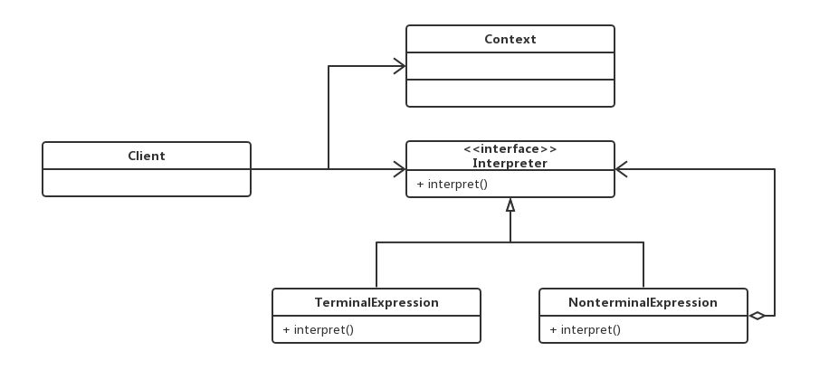
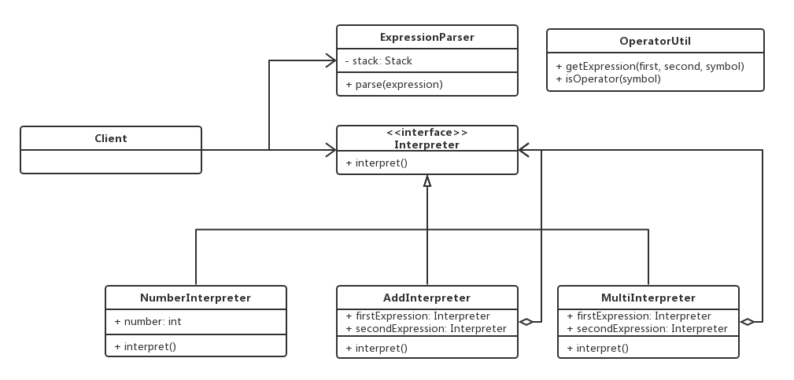

# 解释器模式

## 0x01.定义与类型

- 定义：给定一个语言，定义它的文法的一种表示，并定义一个解释器，这个解释器使用该表示来解释语言中的句子。
- 为了解释一种语言，而为语言创建的解释器。
- 类型：行为型
- UML类图



- 一个解释器模式中包含的四种角色
  - 抽象（或接口）解释器(Interpreter)：声明一个所有具体表达式都要实现的抽象接口（或者抽象类），接口中主要是一个interpret()方法，称为解释操作。具体解释任务由它的各个实现类来完成，具体的解释器分别由终结符解释器和非终结符解释器完成。
  - 终结符表达式（TerminalExpression）：实现与文法中的元素相关联的解释操作，通常一个解释器模式中只有一个终结符表达式，但有多个实例，对应不同的终结符。终结符一半是文法中的运算单元，比如有一个简单的公式R=R1+R2，在里面R1和R2就是终结符，对应的解析R1和R2的解释器就是终结符表达式。
  - 非终结符表达式（NonterminalExpression）：文法中的每条规则对应于一个非终结符表达式，非终结符表达式一般是文法中的运算符或者其他关键字，比如公式R=R1+R2中，+就是非终结符，解析+的解释器就是一个非终结符表达式。非终结符表达式根据逻辑的复杂程度而增加，原则上每个文法规则都对应一个非终结符表达式。
  - 环境角色（Context）：这个角色的任务一般是用来存放文法中各个终结符所对应的具体值，比如R=R1+R2，我们给R1赋值100，给R2赋值200。这些信息需要存放到环境角色中，很多情况下我们使用Map来充当环境角色就足够了。

## 0x02.适用场景

- 在某个特定类型问题发生频率足够高，需要自定义语法的场景。比如数据按照配置规则ETL！

## 0x03.优缺点

### 1.优点

- 语法由很多类表示，容易改变及扩展此“语言”

### 2.缺点

- 当语法规则数目太多时，增加了系统复杂度

## 0x04.样例代码

> 使用解释器模式实现一个简单的语法 计算 **6 100 11 + *** 表达式，首先记录数值，然后按照顺序添加符号计算。
> 100 + 11
> 111 * 6
> 666

- java代码实现

```java
/**
 * 表达式定义接口
 */
public interface Interpreter {
    int interpret();
}

/**
 * 相加表达式
 */
public class AddInterpreter implements Interpreter {

    private Interpreter firstExpression, secondExpression;

    public AddInterpreter (Interpreter firstExpression, Interpreter secondExpression) {
        this.firstExpression = firstExpression;
        this.secondExpression = secondExpression;
    }

    @Override
    public int interpret() {
        return this.firstExpression.interpret() + this.secondExpression.interpret();
    }

    @Override
    public String toString() {
        return "+";
    }
}

/**
 * 相乘规则表达式
 */
public class MultiInterpreter implements Interpreter {

    private Interpreter firstExpression, secondExpression;

    public MultiInterpreter(Interpreter firstExpression, Interpreter secondExpression) {
        this.firstExpression = firstExpression;
        this.secondExpression = secondExpression;
    }


    @Override
    public int interpret() {
        return this.firstExpression.interpret() * this.secondExpression.interpret();
    }

    @Override
    public String toString() {
        return "*";
    }
}

/**
 * 数值型表达式
 */
public class NumberInterpreter implements Interpreter {

    private int number;

    public NumberInterpreter(int number) {
        this.number = number;
    }

    public NumberInterpreter(String number){
        this.number = Integer.parseInt(number);
    }

    @Override
    public int interpret() {
        return this.number;
    }
}

/**
 * 格式化表达式
 */
public class ExpressionParser {

    private Stack<Interpreter> stack = new Stack<>();

    public int parse (String expression) {
        String[] itemArray = expression.split(" ");
        for (String symbol : itemArray) {
            if (!OperatorUtil.isOperator(symbol)) {
                Interpreter numberExpression = new NumberInterpreter(symbol);
                stack.push(numberExpression);
                System.out.println(String.format("入栈： %d", numberExpression.interpret()));
            } else {
                //是运算符可以计算
                Interpreter firstExpression = stack.pop();
                Interpreter secondExpression = stack.pop();
                System.out.println(String.format("出栈：%d 和 %d", firstExpression.interpret(),
                        secondExpression.interpret()));
                Interpreter operator = OperatorUtil.getExpression(firstExpression, secondExpression, symbol);
                System.out.println(String.format("应用运算符: %s", operator));
                int result = operator.interpret();
                NumberInterpreter numberInterpreter = new NumberInterpreter(result);
                stack.push(numberInterpreter);
                System.out.println(String.format("阶段结果入栈: %d", result));
            }
        }
        return stack.pop().interpret();
    }
}

/**
 * 工具类
 */
public class OperatorUtil {

    public static boolean isOperator(String symbol) {
        return (symbol.equals("+") || symbol.equals("*"));
    }

    public static Interpreter getExpression(Interpreter first,
                                            Interpreter second,
                                            String symbol) {
        switch (symbol) {
            case "+":
                return new AddInterpreter(first, second);
            case "*":
                return new MultiInterpreter(first, second);
            default:
                return null;
        }
    }
}
```

- 测试与应用

```java
/**
 * 测试类
 */
public class Test {

    public static void main(String[] args) {
        String input = "6 100 11 + *";
        ExpressionParser parser = new ExpressionParser();
        int result = parser.parse(input);
        System.out.println("解释器运算结果：" + result);
    }
}
```

- 输出日志

```log
入栈： 6
入栈： 100
入栈： 11
出栈：11 和 100
应用运算符: +
阶段结果入栈: 111
出栈：111 和 6
应用运算符: *
阶段结果入栈: 666
解释器运算结果：666
```

- 代码对应的UML类图



在样例中：AddInterpreter和MultiInterpreter为终结表达式，NumberInterpreter为非终结表达式，ExpressionParser为环境角色。

## 0x05.相关设计模式

- 解释器模式和适配器模式
  - 适配器模式不需要先知道适配的规则
  - 解释器模式要预先知道语法规则

## 0x06.源码中的解释器模式

- Pattern
- Spring SpelExpressionParse

## 0x07.代码地址

- `设计模式之解释器模式`: [https://github.com/sigmako/design-pattern/tree/master/interpreter](https://github.com/sigmako/design-pattern/tree/master/interpreter)

## 0x08.推荐阅读

- `慕课网设计模式精讲`: [https://coding.imooc.com/class/270.html](https://coding.imooc.com/class/270.html)
- `23种设计模式（14）：解释器模式`: [https://blog.csdn.net/zhengzhb/article/details/7666020](https://blog.csdn.net/zhengzhb/article/details/7666020)
