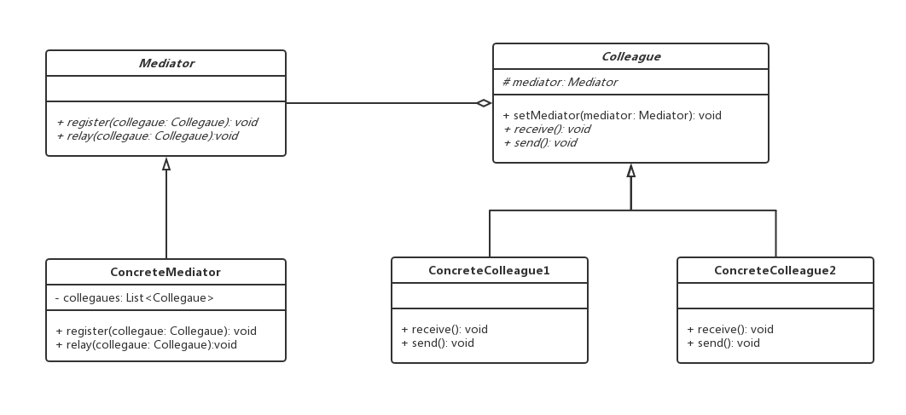

# 中介者模式

## 0x01.定义与类型

- 定义：定义一个中介对象来封装一系列对象之间的交互，使原有对象之间的耦合松散，且可以独立地改变它们之间的交互。中介者模式又叫调停模式，它是迪米特法则的典型应用。
- 通过使对象明确地相互引用来促进松散耦合，并允许独立地改变它们的交互。
- 类型：行为型
- 模式简单实现

```java
/**
 * 同事抽象类
 */
public abstract class Colleague {

    //中介者抽象类
    protected Mediator mediator;

    //接受消息
    public abstract void receive();

    //发送消息
    public abstract void send();

    public void setMediator(Mediator mediator) {
        this.mediator = mediator;
    }
}

/**
 * 中介者抽象类
 */
public abstract class Mediator {

    //注册同事
    abstract void register(Colleague colleague);

    //通知中介者，发送消息
    abstract void relay(Colleague colleague);

}

/***
 * 中介者实现类
 */
public class ConcreteMediator implements Mediator {

    /**
     * 被中介者代理的同事
     */
    private List<Colleague> colleagues;

    public ConcreteMediator() {
        colleagues = new ArrayList<>();
    }

    public void register(Colleague colleague) {
        if (!colleagues.contains(colleague)) {
            colleague.setMediator(this);
            this.colleagues.add(colleague);
        }
    }

    public void relay(Colleague colleague) {
        colleagues.forEach(c -> {
            if (!c.equals(colleague)) {
                c.receive();
            }
        });
    }
}

/**
 * 具体的同事类1
 */
public class ConcreteColleague1 extends Colleague {
    @Override
    public void receive() {
        System.out.println("colleague1 receive message.");
    }

    @Override
    public void send() {
        System.out.println("colleague1 send message.");
        //请中介者转发
        this.mediator.relay(this);
    }
}

/**
 * 具体的同事类2
 */
public class ConcreteColleague2 extends Colleague {
    @Override
    public void receive() {
        System.out.println("colleague2 receive message.");
    }

    @Override
    public void send() {
        System.out.println("colleague2 send message.");
        //请中介者转发
        this.mediator.relay(this);
    }
}
```

- 测试与应用

```java
/**
 * 测试与应用
 */
public class Test {

    public static void main(String[] args) {
        //构建中介者
        Mediator mediator = new ConcreteMediator();

        //构建具体的同事类
        Colleague colleague1 = new ConcreteColleague1();
        Colleague colleague2 = new ConcreteColleague2();

        //注册同事
        mediator.register(colleague1);
        mediator.register(colleague2);

        //发送消息
        colleague1.send();
        colleague2.send();
    }
}
```

- 输入结果

```log
colleague1 send message.
colleague2 receive message.
colleague2 send message.
colleague1 receive message.
```

- 样例代码UML类图



- 中介者模式角色介绍
  - 抽象中介者（Mediator）角色：它是中介者的接口，提供了同事对象注册与转发同事对象信息的抽象方法。
  - 具体中介者（ConcreteMediator）角色：实现中介者接口，定义一个 List 来管理同事对象，协调各个同事角色之间的交互关系，因此它依赖于同事角色。
  - 抽象同事类（Colleague）角色：定义同事类的接口，保存中介者对象，提供同事对象交互的抽象方法，实现所有相互影响的同事类的公共功能。
  - 具体同事类（Concrete Colleague）角色：是抽象同事类的实现者，当需要与其他同事对象交互时，由中介者对象负责后续的交互。

## 0x02.适用场景

- 系统中对象之间存在复杂的引用关系，产生的相互依赖关系结构混乱且难以理解。
- 交互的公共行为，如果需要改变行为则可以增加新的中介者类

## 0x03.优缺点

### 1.优点

- 降低了对象之间的耦合性，使得对象易于独立地被复用。
- 将对象间的一对多关联转变为一对一的关联，提高系统的灵活性，使得系统易于维护和扩展。

### 2.缺点

- 中介者过多，导致系统复杂

## 0x04.中介模式简单样例

- 学习群组的互相通知，消息的发送由中介者去统一管理

```java
/**
 * 中介者类
 */
public class StudyGroup {

    //发送消息
    public static void showMessage (User user, String message) {
        System.out.println(new Date().toString() + " [" + user.getName() + "] :" + message);
    }
}

/**
 * 一起学习的同学
 */
public class User {

    private String name;

    public String getName() {
        return name;
    }

    public void setName(String name) {
        this.name = name;
    }

    public User (String name) {
        this.name = name;
    }

    public void sendMessage (String message) {
        StudyGroup.showMessage(this, message);
    }
}
```

- 测试与应用类

```java
/**
 * 测试与应用
 */
public class Test {

    public static void main(String[] args) {
        User ko = new User("K.O");
        User tom = new User("Tom");
        ko.sendMessage("learn design pattern.");
        tom.sendMessage("ok!");
    }
}
```

- 输入结果

```log
Sat Nov 16 17:49:06 CST 2019 [K.O] :learn design pattern.
Sat Nov 16 17:49:06 CST 2019 [Tom] :ok!
```

## 0x05.相关设计模式

- 中介者模式和观察者模式
    - 中介者进行通讯

## 0x06.源码中的中介者模式

- Timer#schedule

## 0x07.代码地址

- `设计模式之中介者模式`：[https://github.com/sigmaol/design-pattern/tree/master/mediator](https://github.com/sigmaol/design-pattern/tree/master/mediator)

## 0x08.推荐阅读

- `慕课网设计模式精讲`：[https://coding.imooc.com/class/270.html](https://coding.imooc.com/class/270.html)
- `中介者模式（详解版）`：[http://c.biancheng.net/view/1393.html](http://c.biancheng.net/view/1393.html)
