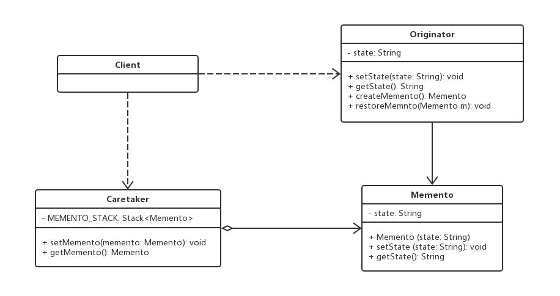
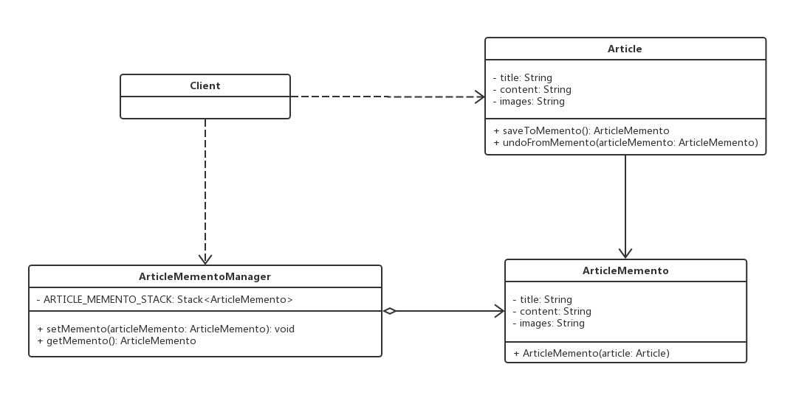

# 备忘录模式

## 0x01.定义与类型

- 定义：在不破坏封装性的前提下，捕获一个对象的内部状态，并在该对象之外保存这个状态，以便以后当需要时能将该对象恢复到原先保存的状态。该模式又叫快照模式。
- 类型：行为型

- UML类图



- 基本代码实现

```java
/**
 * 发起人类
 */
public class Originator {

    /**
     * 状态编码
     */
    private String status;

    public Originator(String status) {
        this.status = status;
    }

    public String getStatus() {
        return status;
    }

    public void setStatus(String status) {
        this.status = status;
    }

    /**
     * 创建备忘录
     * @return
     */
    public Memento createMemento() {
        return new Memento(this);
    }

    /**
     * 回滚
     * @param memento
     */
    public void restoreMemento(Memento memento) {
        this.status = memento.getStatus();
    }
}

/**
 * 备忘录类
 */
public class Memento {

    private String status;

    public Memento(Originator originator) {
        this.status = originator.getStatus();
    }

    public String getStatus() {
        return status;
    }

    public void setStatus(String status) {
        this.status = status;
    }
}

/**
 * 备忘录管理类
 */
public class Caretaker {

    /**
     * 备忘录记录栈
     */
    private Stack<Memento> MEMENTO_STACK;

    public Caretaker() {
        MEMENTO_STACK = new Stack<>();
    }

    /**
     * 添加一个备忘录
     * @param memento
     */
    public void addMemento(Memento memento) {
        MEMENTO_STACK.push(memento);
    }

    /**
     * 获取一个备忘录
     * @return
     */
    public Memento getMemento() {
        return MEMENTO_STACK.pop();
    }

}
```

- 测试与应用

```java
/**
 * 测试与应用
 */
public class Test {

    public static void main(String[] args) {
        //备忘录管理
        Caretaker caretaker = new Caretaker();

        //发起人
        Originator originator = new Originator("1");

        //创建备忘录1
        Memento memento1 = originator.createMemento();
        caretaker.addMemento(memento1);

        //修改并创建备忘录2
        originator.setStatus("2");
        Memento memento2 = originator.createMemento();
        caretaker.addMemento(memento2);

        //修改状态3
        originator.setStatus("3");
        System.out.println(originator.getStatus());

        //回滚上一次
        originator.restoreMemento(caretaker.getMemento());
        System.out.println(originator.getStatus());

        //回滚上一次
        originator.restoreMemento(caretaker.getMemento());
        System.out.println(originator.getStatus());
    }
}
```

- 输出结果

```log
3
2
1
```

- 备忘录模式角色介绍
  - 发起人（Originator）角色：记录当前时刻的内部状态信息，提供创建备忘录和恢复备忘录数据的功能，实现其他业务功能，它可以访问备忘录里的所有信息。
  - 备忘录（Memento）角色：负责存储发起人的内部状态，在需要的时候提供这些内部状态给发起人。
  - 管理者（Caretaker）角色：对备忘录进行管理，提供保存与获取备忘录的功能，但其不能对备忘录的内容进行访问与修改。

## 0x02.适用场景

- 需要保存与恢复数据的场景，如玩游戏时的中间结果的存档功能。
- 需要提供一个可回滚操作的场景，如 Word、记事本、Photoshop，Eclipse 等软件在编辑时按 Ctrl+Z 组合键，还有数据库中事务操作。

## 0x03.优缺点

### 1.优点

- 为用户提供一种可恢复机制
- 存档信息的封装
- 提供了一种可以恢复状态的机制。当用户需要时能够比较方便地将数据恢复到某个历史的状态。
- 实现了内部状态的封装。除了创建它的发起人之外，其他对象都不能够访问这些状态信息。
- 简化了发起人类。发起人不需要管理和保存其内部状态的各个备份，所有状态信息都保存在备忘录中，并由管理者进行管理，这符合单一职责原则。

### 2.缺点

- 资源消耗大。如果要保存的内部状态信息过多或者特别频繁，将会占用比较大的内存资源。

## 0x04.代码实现

> 在线编辑文章时，可以回退功能得备忘录模式实现。

- UML类图



- 代码示例

```java
/**
 * 文章类
 */
public class Article {

    //标题
    private String title;

    //内容
    private String content;

    //图片
    private String images;

    public Article(String title, String content, String images) {
        this.title = title;
        this.content = content;
        this.images = images;
    }

    public String getTitle() {
        return title;
    }

    public void setTitle(String title) {
        this.title = title;
    }

    public String getContent() {
        return content;
    }

    public void setContent(String content) {
        this.content = content;
    }

    public String getImages() {
        return images;
    }

    public void setImages(String images) {
        this.images = images;
    }

    public ArticleMemento saveToMemento() {
        return new ArticleMemento(this);
    }

    public void undoFromMemento(ArticleMemento articleMemento) {
        this.title = articleMemento.getTitle();
        this.content = articleMemento.getContent();
        this.images = articleMemento.getImages();
    }

    @Override
    public String toString() {
        return "Article{" +
                "title='" + title + '\'' +
                ", content='" + content + '\'' +
                ", images='" + images + '\'' +
                '}';
    }
}

/**
 * 备忘录类
 */
public class ArticleMemento {

    private String title;

    private String content;

    private String images;

    public ArticleMemento(Article article) {
        this.title = article.getTitle();
        this.content = article.getContent();
        this.images = article.getImages();
    }

    public String getTitle() {
        return title;
    }

    public String getContent() {
        return content;
    }

    public String getImages() {
        return images;
    }

    @Override
    public String toString() {
        return "ArticleMemento{" +
                "title='" + title + '\'' +
                ", content='" + content + '\'' +
                ", images='" + images + '\'' +
                '}';
    }
}

/**
 * 备忘录管理类
 */
public class ArticleMementoManager {

    private final Stack<ArticleMemento> ARTICLE_MEMENTO_STACK = new Stack<>();

    public ArticleMemento getMemento () {
        return ARTICLE_MEMENTO_STACK.pop();
    }

    public void addMemento(ArticleMemento articleMemento) {
        ARTICLE_MEMENTO_STACK.push(articleMemento);
    }

}
```

- 测试与应用类

```java
/**
 * 测试与应用
 */
public class Test {

    public static void main(String[] args) {
        //创建备忘录管理
        ArticleMementoManager articleMementoManager = new ArticleMementoManager();

        Article article = new Article("如影随形的设计模式A", "内容A", "图片A");

        ArticleMemento articleMemento = article.saveToMemento();

        articleMementoManager.addMemento(articleMemento);

        System.out.println(article.toString());

        article.setTitle("修改手记start");
        article.setContent("手记内容B");
        article.setImages("手记图片B");

        System.out.println(article);

        articleMemento = article.saveToMemento();

        articleMementoManager.addMemento(articleMemento);

        article.setTitle("设计模式C");
        article.setContent("手记内容C");
        article.setImages("手记图片C");

        System.out.println(article.toString());

        System.out.println("回退出栈一次");
        articleMemento = articleMementoManager.getMemento();
        article.undoFromMemento(articleMemento);

        System.out.println(article.toString());

        System.out.println("回退出栈两次");
        articleMemento = articleMementoManager.getMemento();
        article.undoFromMemento(articleMemento);

        System.out.println(article.toString());
    }
}
```

- 输出结果

```log
Article{title='design-pattern1', content='memento1', images='memento1'}
Article{title='design-pattern2', content='memento2', images='memento2'}
Article{title='design-pattern3', content='memento3', images='memento3'}
pop stack 1.
Article{title='design-pattern2', content='memento2', images='memento2'}
pop stack 2.
Article{title='design-pattern1', content='memento1', images='memento1'}
```

## 0x05.相关设计模式

- 备忘录模式和状态模式
  - 备忘录：用实例表示状态
  - 状态：用类来表示状态

## 0x06.源码中的备忘录模式

- spring webflow: StateManageableMessageContext

## 0x07.代码地址

- `设计模式之备忘录模式`：[https://github.com/sigmaol/design-pattern/tree/master/memento](https://github.com/sigmaol/design-pattern/tree/master/memento)

## 0x08.推荐阅读

- `慕课网设计模式精讲`：[https://coding.imooc.com/class/270.html](https://coding.imooc.com/class/270.html)
- `备忘录模式（详尽版）`：[http://c.biancheng.net/view/1400.html](http://c.biancheng.net/view/1400.html)
