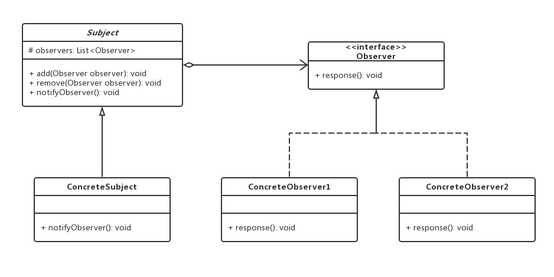

# 观察者模式

## 0x01.定义与类型

- 定义：定义了对象之间的一对多依赖，让多个观察者对象同时监听某一个主题对象，当主题对象发生变化时，它的所有依赖者（观察者）都会收到通知并更新。
- 类型：行为型
- UML类图



- 示例代码实现

```java
/**
 * 被观察实例抽象定义
 */
public abstract class Subject {

    /**
     * 观察者数组
     */
    protected List<Observer> observers;

    /**
     * 添加一个观察者
     * @param observer
     */
    public abstract void add(Observer observer);

    /**
     * 删除一个观察者
     * @param observer
     */
    public abstract void remove(Observer observer);


    /**
     * 通知观察者
     */
    public abstract void notifyObserver();
}

/**
 * 观察者接口
 */
public interface Observer {
    void response();
}

/**
 * 被观察的实例
 */
public class ConcreteSubject extends Subject {

    public ConcreteSubject() {
        super.observers = new ArrayList<>();
    }

    @Override
    public void add(Observer observer) {
        this.observers.add(observer);
    }

    @Override
    public void remove(Observer observer) {
        this.observers.remove(observer);
    }

    @Override
    public void notifyObserver() {
        for (Observer observer : this.observers) {
            observer.response();
        }
    }
}

/**
 * 观察者1
 */
public class ConcreteObserver1 implements Observer {
    @Override
    public void response() {
        System.out.println("通知观察者1");
    }
}

/**
 * 观察者2
 */
public class ConcreteObserver2 implements Observer {
    @Override
    public void response() {
        System.out.println("通知观察者2");
    }
}
```

- 测试与应用

```java
/**
 * 测试与应用
 */
public class Test {

    public static void main(String[] args) {
        //创建实例
        Subject subject = new ConcreteSubject();

        //创建观察者对象
        Observer observer1 = new ConcreteObserver1();
        Observer observer2 = new ConcreteObserver2();

        //添加观察者对象
        subject.add(observer1);
        subject.add(observer2);

        //通知观察者
        subject.notifyObserver();
    }
}
```

- 输出结果

```log
通知观察者1
通知观察者2
```

- 角色介绍：
  - 抽象被观察者角色（Subject）：也就是一个抽象主题，它把所有对观察者对象的引用保存在一个集合中，每个主题都可以有任意数量的观察者。抽象主题提供一个接口，可以增加和删除观察者角色。一般用一个抽象类和接口来实现。
  - 观察者角色接口（Observer）：为所有的具体观察者定义一个接口，在得到主题通知时更新自己。
  - 具体被观察者角色（ConcreteSubject）：也就是一个具体的主题，在集体主题的内部状态改变时，所有登记过的观察者发出通知。
  - 具体观察者角色（ConcreteObserver）：实现抽象观察者角色所需要的更新接口，一边使本身的状态与主题的状态相协调。

## 0x02.适用场景

- 关联行为场景，建立一套触发机制

## 0x03.优缺点

### 1.优点

- 观察者和被观察者之间建立一个抽象的耦合
- 观察者模式支持广播通信

### 2.缺点

- 观察者之间有过多的细节依赖，提高时间消耗以及程序复杂度
- 使用要得当，要避免循环调用

## 0x04.代码示例

> 使用jdk观察者工具类实现，学生提出问题，多个老师接收问题。

- 具体实现

```java
/**
 * 观察者
 */
public class Teacher implements Observer {

    private String teacherName;

    public Teacher(String teacherName) {
        this.teacherName = teacherName;
    }

    @Override
    public void update(Observable o, Object arg) {
        Course course = (Course) o;
        Question question = (Question) arg;

        System.out.println(teacherName + "老师的" + course.getCourseName()
                + "课程接收到一个" + question.getUsername()
                + "提出的" + question.getQuestionContent() + "问题");
    }
}

/**
 * 被观察对象实体
 */
public class Course extends Observable {

    private String courseName;

    public Course(String courseName) {
        this.courseName = courseName;
    }

    public String getCourseName() {
        return courseName;
    }

    public void produceQuestion(Course course, Question question) {
        System.out.println(question.getUsername() + "在" + course.getCourseName() + "提交了一个问题。");
        setChanged();
        notifyObservers(question);
    }
}

/**
 * 问题实体
 */
public class Question {

    private String username;

    private String questionContent;

    public String getUsername() {
        return username;
    }

    public void setUsername(String username) {
        this.username = username;
    }

    public String getQuestionContent() {
        return questionContent;
    }

    public void setQuestionContent(String questionContent) {
        this.questionContent = questionContent;
    }
}
```

- 测试与应用

```java
/**
 * 测试类
 */
public class Test {

    public static void main(String[] args) {
        Course course = new Course("Javas设计模式精讲");
        Teacher teacher1 = new Teacher("Alpha");
        Teacher teacher2 = new Teacher("Beta");

        course.addObserver(teacher1);
        course.addObserver(teacher2);

        //业务逻辑代码
        Question question = new Question();
        question.setUsername("K.O");
        question.setQuestionContent("Java的主函数如何编写");

        course.produceQuestion(course, question);

    }
}
```

- 输出

```log
K.O在Javas设计模式精讲提交了一个问题。
Beta老师的Javas设计模式精讲课程接收到一个K.O提出的Java的主函数如何编写问题
Alpha老师的Javas设计模式精讲课程接收到一个K.O提出的Java的主函数如何编写问题
```

- UML类图


## 0x05.扩展

- google guava中的`@Subscribe`注解

```java
public class GuavaEvent {

    @Subscribe
    public void subscribe(String str)  {
        //业务逻辑
        System.out.println("执行subscribe方法，传入的参数是：" + str);
    }

}
```

- 测试类

```java
/**
 * 测试
 */
public class Test {

    public static void main(String[] args) {
        EventBus eventBus = new EventBus();
        GuavaEvent guavaEvent = new GuavaEvent();
        eventBus.register(guavaEvent);
        eventBus.post("post的内容");
    }
}
```

- 输出结果

```log
执行subscribe方法，传入的参数是：post的内容
```

- `EventBus`会把消息发送到注册的类带有`@Subscribe`的方法中。使用guava可以更容易的使用观察者模式。

## 0x06.源码中的观察者模式

- awt桌面程序，Event
- Listener

## 0x07.源码地址

- `设计模式之观察者模式`：[https://github.com/sigmaol/design-pattern/tree/master/observer](https://github.com/sigmaol/design-pattern/tree/master/observer)

## 0x08.推荐阅读

- `慕课网设计模式精讲`: [https://coding.imooc.com/class/270.html](https://coding.imooc.com/class/270.html)
- `JAVA设计模式之观察者模式`: [https://www.cnblogs.com/luohanguo/p/7825656.html](https://www.cnblogs.com/luohanguo/p/7825656.html)
