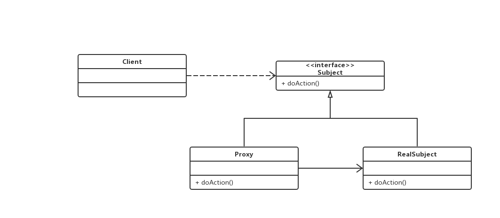

# 代理模式

## 0x01.定义与类型

- 定义：为其他对象提供一种代理，以控制对这个对象的访问。
- 代理对象在客户端和目标对象之间起到中介的作用，可去掉功能服务或增加额外的服务。
- 类型：结构型

- 几种代理方式：
  1. 远程代理--为不同地理的对象，提供局域网代表对象---通过远程代理来模拟各个店铺的监控
  2. 虚拟代理--根据需要将资源消耗很大的对象进行延迟-真正需要的时候进行创建--比如说先加载文字-图片是虚拟的-再加载
  3. 保护代理--控制一个对象的访问权限--权限控制
  4. 智能引用代理--火车票代售处

## 0x02.适用场景

- 保护目标对象
- 增强目标对象

## 0x03.优缺点

### 优点

- 代理模式能将代理对象与真实被调用的目标对象分离
- 一定程度上降低了系统的耦合度，扩展性好
- 保护目标对象
- 增强目标对象

### 缺点

- 代理模式会造成系统设计中类的数据增加
- 在客户端和目标对象增加一个代理对象，会造成请求处理速度缓慢
- 增加了系统的复杂度

## 0x04.扩展

### 1.静态代理

- 定义：通过在代码中显示定义了一个业务实现类的代理，在代理类中实现了同名的被代理类的方法，通过调用代理类的方法，实现对被代理类方法的增强。代理和被代理对象在代理在代理之前是确定的，他们都是实现的相同的接口或者继承相同的抽象类
- 静态代理UML类图



- 代码实现

```java
/**
 * 被代理的接口类
 * @author zhiyuan.shen
 */
public interface Subject {

    /**
     * 具体方法
     */
    void doAction();

}

/**
 * @author zhiyuan.shen
 */
public class RealSubject implements Subject {
    @Override
    public void doAction() {
        System.out.println("service impl class.");
    }
}

/**
 * 代理类
 * @author zhiyuan.shen
 */
public class Proxy implements Subject {

    private Subject subject;

    public Proxy(Subject subject) {
        this.subject = subject;
    }

    @Override
    public void doAction () {
        System.out.println("before");
        subject.doAction();
        System.out.println("after");
    }

}
```

- 测试与应用类

```java
/**
 * @author zhiyuan.shen
 */
public class Test {

    public static void main(String[] args) {
        //创建服务类
        RealSubject realSubject = new RealSubject();
        //自己执行方法
        realSubject.doAction();

        System.out.println("----------");

        //创建代理类
        Proxy proxy = new Proxy(realSubject);
        //代理执行
        proxy.doAction();

    }
}
```

- 输出结果

```log
service impl class.
----------
before
service impl class.
after
```

- 静态代理角色介绍
  - 共同接口：真实的对象和代理类共同实现的接口，规范方法定义。
  - 真实对象：实现共同接口，可以独立运行，具备完整功能的对象。
  - 代理类：对真实对象的增强，组合了真实对象。

### 2.JDK动态代理

- 定义：通过接口中的方法名在动态生成的代理中动态调用实现类中的同名方法，一定是接口。JDK动态代理利用了JDK API，动态地在内存中构建代理对象，从而实现对目标对象的代理功能。

JDK中生成代理对象主要涉及的类和方法：

java.lang.reflect Proxy类，使用的方法：

```java
public static Object newProxyInstance(ClassLoader loader, Class<?>[] interfaces, InvocationHandler h)
```

这三个参数的含义：
- ClassLoader loader：目标对象的类加载器
- Class<?>[] interfaces：目标对象实现的接口
- InvocationHandler h：事件处理器，代理对象的具体代理操作

java.lang.reflect InvocationHandler接口，使用的方法：

```java
public Object invoke(Object proxy, Method method, Object[] args) throws Throwable;
```

在invoke实现代理类的具体代理操作。

所谓Dynamic Proxy是这样一种class:
- 他是在运行时生成的class
- 该class需要实现一组interface
- 使用动态代理类时，必须实现InvocationHandler接口

- 实现JDK动态代理的步骤
  1. 创建一个实现接口InvocationHandler的类，它必须实现invoke方法
  2. 创建被代理的类以及接口
  3. 调用Proxy的静态方法，创建一个代理类 newProxyInstance(ClassLoader loader, Class[] interfaces, InvocationHandler h)
  4. 通过代理调用方法

- 示例

```java
/**
 * 移动的车接口
 * @author zhiyuan.shen
 */
public interface MoveAble {
    void move();
}

/**
 * 具体的实现类
 * @author zhiyuan.shen
 */
public class Car implements MoveAble {
    /**
     * 实现开车
     */
    @Override
    public void move() {
        try {
            System.out.println("car moving.");
            Thread.sleep(new Random().nextInt(1000));
        } catch (Exception e) {
            e.printStackTrace();
        }
    }
}

/**
 * 时间处理器
 * @author zhiyuan.shen
 */
public class TimeHandler implements InvocationHandler{

    private Object target;

    public TimeHandler(Object target) {
        this.target = target;
    }

    /**
     *
     * @param proxy 被代理的对象
     * @param method 被代理对象的方法
     * @param args 被代理方法的参数
     * @return 方法的返回值
     * @throws Throwable
     */
    @Override
    public Object invoke(Object proxy, Method method, Object[] args) throws Throwable {
        long startTime = System.currentTimeMillis();
        System.out.println("car start...");
        method.invoke(target);
        System.out.println("car end...");
        long endTime = System.currentTimeMillis();
        System.out.println("used " + (endTime - startTime) + " ms！");
        return null;
    }

}
```

- 测试与应用类

```java
public class Main {

    public static void main(String[] args) {
        Car car = new Car();

        InvocationHandler handler = new TimeHandler(car);
        Class<?> clazz = car.getClass();
        /**
         * loader 类加载器
         * interfaces 实现接口
         * InvocationHandler
         *
         * ---动态代理实现思路---
         * 实现功能：通过Proxy的newProxyInstance返回代理对象
         * 1.声明一段源码（动态产生代理）
         * 2.编译源码（JDK Complider API）, 产生一个新的类（代理类）
         * 3.将这个类load到内存当中，产生一个新的对象（代理对象）
         * 4.return 代理对象
         */
        MoveAble moveAble = (MoveAble)Proxy.newProxyInstance(clazz.getClassLoader(), clazz.getInterfaces(), handler);
        moveAble.move();
    }
}
```

- 输出结果

```log
car start...
car end...
used 120 ms?
```

### 3.CGLib代理

- 定义：通过继承，生成的代理类是业务类的子类，重写父类的方法实现代理。CGLIB（CODE GENERLIZE LIBRARY）代理是针对类实现代理，主要是对指定的类生成一个子类，覆盖其中的所有方法，所以该类或方法不能声明称final的。

- cglib特点
  - JDK的动态代理有一个限制，就是使用动态代理的对象必须实现一个或多个接口。如果想代理没有实现接口的类，就可以使用CGLIB实现。
  - CGLIB是一个强大的高性能的代码生成包，它可以在运行期扩展Java类与实现Java接口。
  - 它广泛的被许多AOP的框架使用，例如Spring AOP和dynaop，为他们提供方法的interception（拦截）。
  - CGLIB包的底层是通过使用一个小而快的字节码处理框架ASM，来转换字节码并生成新的类。

- 示例：cglib动态代理需要引入cglib-full-2.0.2.jar包

```xml
<!-- https://mvnrepository.com/artifact/cglib/cglib-full -->
<dependency>
    <groupId>cglib</groupId>
    <artifactId>cglib-full</artifactId>
    <version>2.0.2</version>
</dependency>
```

```java
/**
 * @author zhiyuan.shen
 */
public class Train {
    public void move () {
        System.out.println("train moving...");
    }
}

/**
 * 代理类
 * @author zhiyuan.shen
 */
public class CglibProxy implements MethodInterceptor {

    private Enhancer enhancer = new Enhancer();

    //得到代理类
    public Object getProxy (Class clazz) {
        //设置创建子类的类
        enhancer.setSuperclass(clazz);
        //设置回调
        enhancer.setCallback(this);
        //返回创建的实例
        return enhancer.create();
    }

    /**
     * 拦截所有目标类方法的调用
     * @param object 目标类的实例
     * @param method 目标方法的反射对象
     * @param args 方法的参数
     * @param methodProxy proxy代理类的实例
     * @return
     * @throws Throwable
     */
    @Override
    public Object intercept(Object object, Method method, Object[] args, MethodProxy methodProxy) throws Throwable {
        System.out.println("log start..");
        methodProxy.invokeSuper(object, args);
        System.out.println("log end..");
        return null;
    }

}
```

- 测试与应用

```java
/**
 * @author zhiyuan.shen
 */
public class Main {

    public static void main(String[] args) {
        CglibProxy proxy = new CglibProxy();
        Train train = (Train)proxy.getProxy(Train.class);
        train.move();
    }
}
```

- 输出结果

```log
log start..
train moving...
log end..
```

### 4.JDK动态代理和CGLIB动态代理区别

- JDK动态代理：
  1. 只能代理实现了接口的类
  2. 没有实现接口的类不能实现JDK动态代理

- CGLIB动态代理：
  1. 针对类来实现代理
  2. 对指定目标类产生一个子类，通过方法拦截技术拦截所有父类方法的调用
  3. 不能对final的类代理

## 0x05.Spring代理选择

- 当Bean有实现接口时，Spring就会用JDK的动态代理
- 当Bean没有实现接口时，Spring适用CGLib
- 可以强制适用Cglib，在spring配置中加入<aop:aspectj-autoproxy proxy-target-class="true"/>
- 查看spring core官方文档

## 0x06.代理速度的扩展

- CGLib --> ASM字节码生成
- JDK动态代理
- jdk比cglib快20%左右

## 0x07.相关设计模式

- 代理模式和装饰者模式
    - 装饰者模式是为对象添加行为
    - 代理模式是控制对象的访问，增强目标对象
- 代理模式和适配器模式
    - 适配器模式考虑对象的接口
    - 代理不能代理接口

## 0x08.源码地址

- `代理模式`: [https://github.com/sigmako/design-pattern/tree/master/proxy](https://github.com/sigmako/design-pattern/tree/master/proxy)

## 0x09.参考文章

- `慕课网设计模式精讲`: [https://coding.imooc.com/class/270.html](https://coding.imooc.com/class/270.html)
- `设计模式之代理模式`: [https://www.cnblogs.com/binaway/p/9754775.html](https://www.cnblogs.com/binaway/p/9754775.html)
