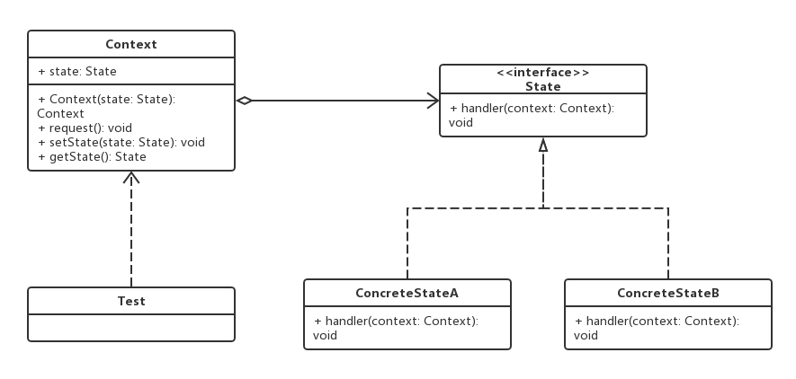
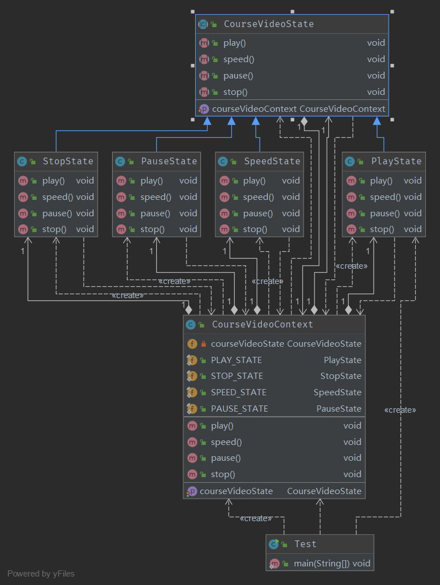

# 状态模式

## 0x01.定义与类型

- 定义：允许一个对象在内部状态改变时，改变它的行为。
- 类型：行为型
- UML类图，这个基本实现类似电灯开关那种（0，1）的状态切换。



- Java实现

```java
/**
 * 状态上下文
 * 维护一个state实例，这个为实体当前的状态
 */
public class Context {

    /**
     * 当前的状态
     */
    private State state;

    /**
     * 构造函数
     * @param state
     */
    public Context(State state) {
        this.state = state;
    }

    /**
     * 请求状态
     */
    public void request() {
        state.handler(this);
    }

    //--set get

    public State getState() {
        return state;
    }

    public void setState(State state) {
        this.state = state;
    }
}

/**
 * 状态接口
 */
public interface State {

    void handler(Context context);

}

/**
 * 具体的状态
 */
public class ConcreteStateA implements State {
    @Override
    public void handler(Context context) {
        System.out.println("this is state A.");
        context.setState(new ConcreteStateB());
    }
}

/**
 * 具体的状态
 */
public class ConcreteStateB implements State {
    @Override
    public void handler(Context context) {
        System.out.println("this is state B.");
        context.setState(new ConcreteStateA());
    }
}
```

- 测试与应用

```java
/**
 * 测试与应用
 */
public class Test {

    public static void main(String[] args) {
        //创建状态上下文
        Context context = new Context(new ConcreteStateA());

        //切换状态, 这个有点类似电灯的开关状态
        context.request();
        context.request();
        context.request();
        context.request();
        context.request();
    }
}
```

- 输入日志

```log
this is state A.
this is state B.
this is state A.
this is state B.
this is state A.
```

- 状态模式中的角色介绍
  - 上下文环境（Context）：它定义了客户端程序需要的接口并维护一个具体状态角色的实例，将与状态相关的操作委托给当前的Concrete State对象来处理。
  - 抽象状态（State）：定义一个接口以封装使用上下文环境的一个特定状态的相关的行为。
  - 具体状态（Concrete State）：实现抽象状态定义的接口。

## 0x02.适用场景

- 一个对象存在多个状态（不同状态下行为不同），且状态可相互转换。
- 电商订单状态扭转
- 主要解决的是当控制一个对象状态转换的条件表达式过于复杂时的情况。把状态的判断逻辑转移到表示不同的一系列类当中，可以把复杂的逻辑判断简单化。

## 0x03.优缺点

### 1.优点

- 状态模式将与特定状态相关的行为局部化，把不同的状态隔离。
- 把各种状态的转换逻辑，分布到State的子类中，减少相互间的依赖。
- 所有状态相关的代码都在子类中，所以增加新的状态非常简单。

### 2.缺点

- 状态多的业务场景导致类数目增加，系统变复杂。

## 0x04.状态模式样例

> 假设一个视频的播放有播放中、暂停、快进和停止等等状态，使用状态模式实现这个功能。

- Java实现

```java
/**
 * 课程状态上下文
 */
public class CourseVideoContext {

    //当前状态
    private CourseVideoState courseVideoState;

    //播放
    public final static PlayState PLAY_STATE = new PlayState();

    //停止
    public final static StopState STOP_STATE = new StopState();

    //快进
    public final static SpeedState SPEED_STATE = new SpeedState();

    //暂停
    public final static PauseState PAUSE_STATE = new PauseState();

    public CourseVideoState getCourseVideoState() {
        return courseVideoState;
    }

    public void setCourseVideoState(CourseVideoState courseVideoState) {
        this.courseVideoState = courseVideoState;
        this.courseVideoState.setCourseVideoContext(this);
    }

    public void play() {
        this.courseVideoState.play();
    }

    public void speed() {
        this.courseVideoState.speed();
    }

    public void pause() {
        this.courseVideoState.pause();
    }

    public void stop() {
        this.courseVideoState.stop();
    }
}

/**
 * 状态
 */
public abstract class CourseVideoState {

    protected CourseVideoContext courseVideoContext;

    public void setCourseVideoContext(CourseVideoContext courseVideoContext) {
        this.courseVideoContext = courseVideoContext;
    }

    public abstract void play();

    public abstract void speed();

    public abstract void pause();

    public abstract void stop();
}

/**
 * 暂停状态
 */
public class PauseState extends CourseVideoState {

    @Override
    public void play() {
        super.courseVideoContext.setCourseVideoState(CourseVideoContext.PLAY_STATE);
    }

    @Override
    public void speed() {
        super.courseVideoContext.setCourseVideoState(CourseVideoContext.SPEED_STATE);
    }

    @Override
    public void pause() {
        System.out.println("暂停播放视频");
    }

    @Override
    public void stop() {
        super.courseVideoContext.setCourseVideoState(CourseVideoContext.STOP_STATE);
    }
}

/**
 * 播放状态
 */
public class PlayState extends CourseVideoState {
    @Override
    public void play() {
        System.out.println("正常播放视频的状态");
    }

    @Override
    public void speed() {
        super.courseVideoContext.setCourseVideoState(CourseVideoContext.SPEED_STATE);
    }

    @Override
    public void pause() {
        super.courseVideoContext.setCourseVideoState(CourseVideoContext.PAUSE_STATE);
    }

    @Override
    public void stop() {
        super.courseVideoContext.setCourseVideoState(CourseVideoContext.STOP_STATE);
    }
}

/**
 * 加速状态
 */
public class SpeedState extends CourseVideoState  {
    @Override
    public void play() {
        super.courseVideoContext.setCourseVideoState(CourseVideoContext.PLAY_STATE);
    }

    @Override
    public void speed() {
        System.out.println("快进播放视频");
    }

    @Override
    public void pause() {
        super.courseVideoContext.setCourseVideoState(CourseVideoContext.PAUSE_STATE);
    }

    @Override
    public void stop() {
        super.courseVideoContext.setCourseVideoState(CourseVideoContext.STOP_STATE);
    }
}

/**
 * 停止状态
 */
public class StopState extends CourseVideoState  {
    @Override
    public void play() {
        super.courseVideoContext.setCourseVideoState(CourseVideoContext.PLAY_STATE);
    }

    @Override
    public void speed() {
        System.out.println("ERROR 停止状态不能快进！！！");
    }

    @Override
    public void pause() {
        System.out.println("ERROR 停止状态不能暂停！！！");
    }

    @Override
    public void stop() {
        System.out.println("停止播放视频。");
    }
}
```

- 测试与应用

```java
/**
 * 测试与应用
 */
public class Test {

    public static void main(String[] args) {
        //状态上下文
        CourseVideoContext courseVideoContext = new CourseVideoContext();

        //状态
        courseVideoContext.setCourseVideoState(new PlayState());
        System.out.println("当前状态：" + courseVideoContext.getCourseVideoState().getClass().getSimpleName());

        courseVideoContext.pause();
        System.out.println("当前状态：" + courseVideoContext.getCourseVideoState().getClass().getSimpleName());

        courseVideoContext.speed();
        System.out.println("当前状态：" + courseVideoContext.getCourseVideoState().getClass().getSimpleName());

        courseVideoContext.stop();
        System.out.println("当前状态：" + courseVideoContext.getCourseVideoState().getClass().getSimpleName());

        courseVideoContext.speed();

    }
}
```

- 输入结果

```log
当前状态：PlayState
当前状态：PauseState
当前状态：SpeedState
当前状态：StopState
ERROR 停止状态不能快进！！！
```

- UML类图



## 0x05.相关的设计模式

- 状态模式和享元模式

## 0x06.源码中的状态模式

- javax.Lifecycle

## 0x07.源码地址

- `设计模式之状态模式`：[https://github.com/sigmaol/design-pattern/tree/master/state](https://github.com/sigmaol/design-pattern/tree/master/state)

## 0x08.推荐阅读

- `慕课网设计模式精讲`：[https://coding.imooc.com/class/270.html](https://coding.imooc.com/class/270.html)
- `设计模式学习笔记-状态模式`: [https://www.cnblogs.com/wangjq/archive/2012/07/16/2593485.html](https://www.cnblogs.com/wangjq/archive/2012/07/16/2593485.html)
