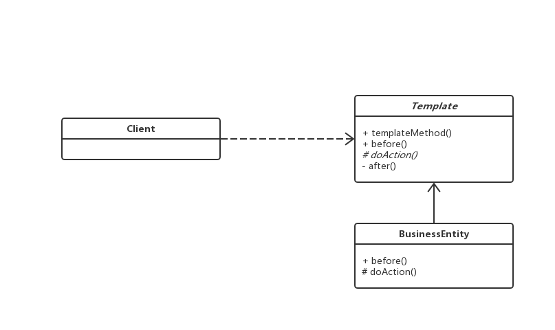
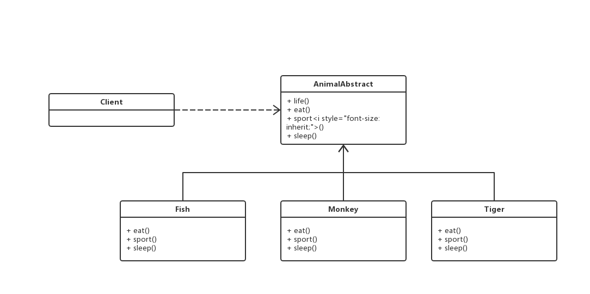

# 模板方法模式

## 0x01.定义与类型

- 定义：定义了一个算法的骨架，并允许子类为一个或多个步骤提供实现
- 准备一个抽象类，将部分逻辑以具体方法以及具体构造函数的形式实现，然后声明一些抽象方法来迫使子类实现剩余的逻辑。
- 不同的子类可以以不同的方式实现这些抽象方法，从而对剩余的逻辑有不同的实现。这就是模板方法模式的用意。
- 比如定义一个操作中的算法的骨架，将步骤延迟到子类中。
- 模板方法使得子类可以再不改变算法结构的情况下，重新定义算法的某些步骤
- 类型：行为型
- UML类图



- 样例代码

```java
/**
 * 模板方法类
 */
public abstract class ATemplate {


    /**
     * 模板方法
     */
    public void templateMethod() {
        before();
        doAction();
        after();
    }

    /**
     * 钩子函数
     * 一个空的方法
     */
    protected void before(){}

    /**
     * 抽象方法
     * 业务逻辑
     */
    public abstract void doAction();

    /**
     * 具体方法
     */
    private void after() {
        System.out.println("after!");
    }
}

/**
 * 具体的实现类
 */
public class BusinessEntity extends ATemplate {

    @Override
    protected void before() {
        super.before();
        System.out.println("before");
    }

    @Override
    public void doAction() {
        System.out.println("doAction");
    }
}
```

- 测试与应用类

```java
public class Test {

    public static void main(String[] args) {
        ATemplate template = new BusinessEntity();
        template.templateMethod();
    }
}
```

- 输出结果

```log
before
doAction
after!
```

- 角色介绍
  - 抽象类（AbstractClass）：实现了模板方法，定义了算法的骨架。
  - 具体类（ConcreteClass)：实现抽象类中的抽象方法，已完成完整的算法。

## 0x02.适用场景

- 一次性实现一个算法不变的部分，并将可变的行为留给子类来实现
- 各子类中公共的行为被提取出来并集中到一个公共父类中，从而避免代码重复
- 控制子类扩展，子类必须遵守算法规则。

## 0x03.优缺点

### 1.优点

- 模板方法模式通过把不变的行为搬移到超类，去除了子类中的重复代码。
- 子类实现算法的某些细节，有助于算法的扩展。
- 通过一个父类调用子类实现的操作，通过子类扩展增加新的行为，符合“开放-封闭原则”。

### 2.缺点

- 类数目的增加
- 增加了系统实现的复杂度
- 继承关系自身缺点，如果父类添加新的抽象方法，所有子类都要改一遍

## 0x04.扩展

- 钩子方法：原理就是实现为空的方法，在某任务之前、之后、执行中、报异常后调用的方法（是不是有种熟悉的感觉）。通常钩子方法是通过抽象类或是本类中的空方法来实现的。

## 0x05.样例代码

> 举例，自然界的动物例如鱼，猴子，老虎都有自己的生活和生活方式。

- 核心代码

```java
/**
 * 抽象类
 */
public abstract class AnimalAbstract {

    /**
     *
     */
    public void life () {
        eat();
        sport();
        sleep();
    }

    public abstract void eat ();

    public abstract void sport ();

    public abstract void sleep ();
}

/**
 * 鱼
 */
public class Fish extends AnimalAbstract {

    @Override
    public void eat() {
        System.out.println("我吃微生物");
    }

    @Override
    public void sport() {
        System.out.println("晃尾巴");
    }

    @Override
    public void sleep() {
        System.out.println("在水中休息");
    }
}

/**
 * 猴子
 */
public class Monkey extends AnimalAbstract {

    @Override
    public void eat() {
        System.out.println("吃香蕉");
    }

    @Override
    public void sport() {
        System.out.println("手舞足蹈");
    }

    @Override
    public void sleep() {
        System.out.println("在树上休息");
    }
}

/**
 * 老虎
 */
public class Tiger extends AnimalAbstract {

    @Override
    public void eat() {
        System.out.println("吃猴子");
    }

    @Override
    public void sport() {
        System.out.println("奔跑");
    }

    @Override
    public void sleep() {
        System.out.println("睡在森林");
    }
}
```

- 测试与应用类

```java
/**
 * 测试与应用类
 */
public class Test {

    public static void main(String[] args) {
        AnimalAbstract fish = new Fish();
        AnimalAbstract monkey = new Monkey();
        AnimalAbstract tiger = new Tiger();
        fish.life();
        monkey.life();
        tiger.life();
    }
}
```

- 输入结果

```log
我吃微生物
晃尾巴
在水中休息
吃香蕉
手舞足蹈
在树上休息
吃猴子
奔跑
睡在森林
```

- 样例UML类图



## 0x06.相关设计模式

- 模板方法模式和工厂方法模式
  - 工厂方法是模板方法的一种特殊实现
- 模板方法模式和策略模式
  - 策略模式：是不同的算法可以相互替换，不影响应用层客户端适用
  - 模板方法：是不改变算法流程，交给子类实现

## 0x07.源码中的模板方法模式

- AbstractList: addAll, get
- AbstractMap
- HttpServlet
- BaseExecutor

## 0x08.源码

- `设计模式之模板方法模式`: [https://github.com/sigmako/design-pattern/tree/master/template-method](https://github.com/sigmako/design-pattern/tree/master/template-method)

## 0x09.推荐阅读

- `慕课网设计模式精讲`: [https://coding.imooc.com/class/270.html](https://coding.imooc.com/class/270.html)
- `java回调方法、钩子方法以及模板方法模式`: [https://www.cnblogs.com/koala2016/p/5766478.html](https://www.cnblogs.com/koala2016/p/5766478.html)
