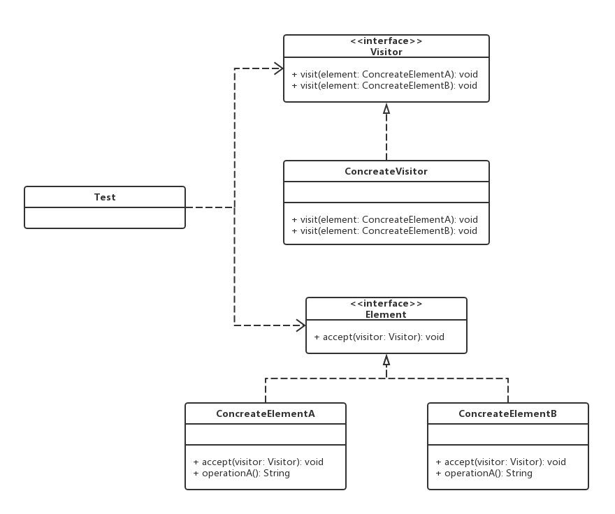

# 访问者模式

## 0x01.定义与类型

- 定义：将作用于某种数据结构中的各元素的操作分离出来封装成独立的类，使其在不改变数据结构的前提下可以添加作用于这些元素的新的操作，为数据结构中的每个元素提供多种访问方式。它将对数据的操作与数据结构进行分离，是行为类模式中最复杂的一种模式。
- 补充定义：可以在不改变各元素的类的前提下，定义作用于这些元素的操作。
- 类型：行为型
- UML类图



- Java实现

```java
/**
 * 访问者接口
 */
public interface Visitor {

    /**
     * 访问A
     * @param element
     */
    void visit(ConcreteElementA element);

    /**
     * 访问B
     * @param element
     */
    void visit(ConcreteElementB element);

}

/**
 * 被访问对象接口
 */
public interface Element {

    void accept(Visitor visitor);

    String operation();
}

/**
 * 具体的访问者
 */
public class ConcreteVisitor implements Visitor {
    @Override
    public void visit(ConcreteElementA element) {
        System.out.println("visit: " + element.operation());
    }

    @Override
    public void visit(ConcreteElementB element) {
        System.out.println("visit: " + element.operation());
    }
}

/**
 * 具体实例A
 */
public class ConcreteElementA implements Element {
    @Override
    public void accept(Visitor visitor) {
        visitor.visit(this);
    }

    @Override
    public String operation() {
        return "ConcreteElementA";
    }
}

/**
 * 具体实例B
 */
public class ConcreteElementB implements Element {
    @Override
    public void accept(Visitor visitor) {
        visitor.visit(this);
    }

    @Override
    public String operation() {
        return "ConcreteElementB";
    }
}
```

- 测试与应用

```java
/**
 * 测试与应用类
 */
public class Test {

    public static void main(String[] args) {
        //初始化被访问列表
        List<Element> elements = new ArrayList<>();

        //初始化访问者
        Visitor visitor = new ConcreteVisitor();

        //初始化元素
        Element element1 = new ConcreteElementA();
        Element element2 = new ConcreteElementB();

        //装填
        elements.add(element1);
        elements.add(element2);

        //访问
        elements.forEach(e -> e.accept(visitor));
    }

}
```

- 输入结果

```log
visit: ConcreteElementA
visit: ConcreteElementB
```

- 访问者中的元素
  - 抽象访问者（Visitor）角色：定义一个访问具体元素的接口，为每个具体元素类对应一个访问操作 visit() ，该操作中的参数类型标识了被访问的具体元素。
  - 具体访问者（ConcreteVisitor）角色：实现抽象访问者角色中声明的各个访问操作，确定访问者访问一个元素时该做什么。
  - 抽象元素（Element）角色：声明一个包含接受操作 accept() 的接口，被接受的访问者对象作为 accept() 方法的参数。
  - 具体元素（ConcreteElement）角色：实现抽象元素角色提供的 accept() 操作，其方法体通常都是 visitor.visit(this) ，另外具体元素中可能还包含本身业务逻辑的相关操作。

- 注：测试类中，一般都是具有一个包含所有对象的容器，提供让访问者遍历所有元素的方法。

## 0x02.适用场景

- 一个数据结构如（List/Set/Map等）包含很多类型对象
- 数据结构与数据操作分离

## 0x03.优缺点

### 1.优点

- 扩展性好。能够在不修改对象结构中的元素的情况下，为对象结构中的元素添加新的功能。
- 复用性好。可以通过访问者来定义整个对象结构通用的功能，从而提高系统的复用程度。
- 灵活性好。访问者模式将数据结构与作用于结构上的操作解耦，使得操作集合可相对自由地演化而不影响系统的数据结构。
- 符合单一职责原则。访问者模式把相关的行为封装在一起，构成一个访问者，使每一个访问者的功能都比较单一。

### 2.缺点

- 增加新的元素类很困难。在访问者模式中，每增加一个新的元素类，都要在每一个具体访问者类中增加相应的具体操作，这违背了“开闭原则”。
- 破坏封装。访问者模式中具体元素对访问者公布细节，这破坏了对象的封装性，具体元素变更比较麻烦。
- 违反了依赖倒置原则。访问者模式依赖了具体类，而没有依赖抽象类。

## 访问者模式案例

> 使用访问者模式，实现对不同种类课程的访问封装。

- 具体实现

```java
/**
 * 访问者接口
 */
public interface IVisitor {

    void visit(FreeCourse freeCourse);

    void visit(CodingCourse codingCourse);
}

/**
 * 访问者的具体实现
 */
public class Visitor implements IVisitor {
    @Override
    public void visit(FreeCourse freeCourse) {
        System.out.println("free course: " + freeCourse.getName());
    }

    @Override
    public void visit(CodingCourse codingCourse) {
        System.out.println("coding course: " + codingCourse.getName() + " price: " + codingCourse.getPrice());
    }
}

/**
 * 抽象类，课程
 */
public abstract class Course {

    private String name;

    public void setName(String name) {
        this.name = name;
    }

    public String getName() {
        return name;
    }

    abstract void accept(IVisitor visitor);

}


/**
 * 具体的实体类，免费课程
 */
public class FreeCourse extends Course {


    @Override
    void accept(IVisitor visitor) {
        visitor.visit(this);
    }
}

/**
 * 具体的实现类，实战课程
 */
public class CodingCourse extends Course {

    private int price;

    public int getPrice() {
        return price;
    }

    public void setPrice(int price) {
        this.price = price;
    }

    @Override
    void accept(IVisitor visitor) {
        visitor.visit(this);
    }
}
```

- 测试与应用类

```java
/**
 * 测试与应用类
 */
public class Test {

    public static void main(String[] args) {
        //初始化容器
        List<Course> courses = new ArrayList<>();

        //构建课程实现
        FreeCourse freeCourse = new FreeCourse();
        freeCourse.setName("SpringMVC.");

        CodingCourse codingCourse = new CodingCourse();
        codingCourse.setName("Java design pattern.");
        codingCourse.setPrice(299);

        //装填
        courses.add(freeCourse);
        courses.add(codingCourse);

        //访问
        for (Course course : courses) {
            course.accept(new Visitor());
        }
    }
}
```

- 输入结果

```log
free course: SpringMVC.
coding course: Java design pattern. price: 299
```

- UML类图


## 0x05.相关设计模式

- 访问者模式和迭代器模式
    - 访问者，对保存在数据结构中的数据进行某种处理
    - 迭代器主要是遍历

## 0x06.源码中的访问者模式

- jdk.nio.FileVisitor
- Spring.BeanDefinitionVisitor

## 0x07.代码地址

- `设计模式之访问者模式`: [https://github.com/sigmaol/design-pattern/tree/master/visitor](https://github.com/sigmaol/design-pattern/tree/master/visitor)

## 0x08.推荐阅读

- `慕课网设计模式精讲`：[https://coding.imooc.com/class/270.html](https://coding.imooc.com/class/270.html)
- `访问者模式（Visitor模式）详解`: [http://c.biancheng.net/view/1397.html](http://c.biancheng.net/view/1397.html)
